# StockPilot: Final DevOps Project (Session 21)

[](https://github.com/tanishkothari9/DevOps/actions/workflows/final-devops-project.yml)
[](https://github.com/tanishkothari9/devops-final-project/actions/workflows/final-devops-project.yml)

> **Standalone repository.** This is the final project on its own. It was developed inside [`tanishkothari9/DevOps` → `DevOps-main/final-devops-project`](https://github.com/tanishkothari9/DevOps/tree/main/DevOps-main/final-devops-project), and its commit history was imported here. The evidence below (pipeline run links, Argo CD `repoURL`) refers to that monorepo, where the work was done. In this repo the same pipeline runs from the root `.github/workflows/` and publishes `ghcr.io/tanishkothari9/devops-final-project-{backend,frontend}`.

**StockPilot** is a small inventory-management app for a warehouse. You can track SKUs, receive and ship stock, see an audit trail of every movement, and spot items that need reordering. This repository takes it all the way through a DevOps lifecycle:

```text
Application → Git → GitHub → CI pipeline → Build & Test → Security scanning → Docker image
→ Container registry (GHCR) → Kubernetes → Helm → Monitoring (Prometheus/Grafana) → GitOps (Argo CD)
+ Terraform infrastructure + a final troubleshooting challenge
```

Everything in this README comes from commands that were actually run. Each command block is followed by a screenshot of its real output, and the full text of that output is saved under [`outputs/`](outputs/).

| Where it ran | What |
|---|---|
| Laptop (macOS, Docker Desktop) | pytest, frontend build, Docker builds, docker compose, every security scanner, Terraform |
| Local **minikube** cluster (shared course cluster, context `minikube`) | raw manifests, Helm release, Ingress, HPA, kube-prometheus-stack, Argo CD, troubleshooting lab |
| **GitHub Actions** (`ubuntu-latest`) | full CI/CD + DevSecOps pipeline, push to GHCR, deploy to an ephemeral **kind** cluster |
| **LocalStack 3.8** (community, in Docker) | `terraform plan / apply / destroy`. No AWS account is available, see [Terraform](#8-terraform-infrastructure) for the honest details and the one-line switch to real AWS |

> **Kubernetes namespaces:** the cluster is shared with other course sessions, so this project uses the namespaces `taskboard` (Helm release), `taskboard-gitops` (Argo CD-managed copy) and `taskboard-troubleshoot` (troubleshooting lab).

## Table of contents

1. [Project overview](#1-project-overview)
2. [Architecture](#2-architecture)
3. [Technologies used](#3-technologies-used)
4. [Rubric checklist (GRADING.md M1–M10)](#4-rubric-checklist-gradingmd-m1m10)
5. [Application setup](#5-application-setup)
6. [Docker setup](#6-docker-setup)
7. [Kubernetes deployment](#7-kubernetes-deployment)
8. [Terraform infrastructure](#8-terraform-infrastructure)
9. [Helm deployment](#9-helm-deployment)
10. [CI/CD pipeline](#10-cicd-pipeline)
11. [DevSecOps implementation](#11-devsecops-implementation)
12. [Monitoring](#12-monitoring)
13. [GitOps](#13-gitops)
14. [Troubleshooting: final challenge](#14-troubleshooting-final-challenge)
15. [Screenshots](#15-screenshots)
16. [Lessons learned](#16-lessons-learned)

---

## 1. Project overview

| Layer | Implementation |
|---|---|
| Frontend | React 19 + Vite 8 single-page dashboard: KPI cards, search, category filter, "needs reorder" filter, create/edit modal, ±stock buttons, movement history. Responsive: on phones the table turns into cards. Served by **unprivileged nginx** (UID 101, port 8080). |
| Backend | **FastAPI** REST API with SQLAlchemy 2 and **Alembic** migrations. It has 13 routes, 8 of them business APIs (GET/POST/PUT/DELETE + stock adjust + movements + stats). It also exposes `/health` (liveness), `/ready` (DB check, readiness), `/metrics` (Prometheus) and `/docs` (Swagger). |
| Database | **PostgreSQL 16** with two tables, `items` and `stock_movements`, managed by Alembic migration `0001_create_inventory`. In Kubernetes it runs as a StatefulSet with a **PersistentVolumeClaim**. |
| Tests | 13 pytest tests (97% coverage) on an in-memory SQLite DB, so they never touch Postgres. 3 `node --test` unit tests for the frontend helpers. |

**REST API**

| Method | Path | Purpose |
|---|---|---|
| GET | `/api/items?q=&category=&low_stock=` | list and search items |
| GET | `/api/items/{id}` | one item |
| POST | `/api/items` | create an item (409 on duplicate SKU, 422 on invalid payload) |
| PUT | `/api/items/{id}` | update name/category/location/reorder level/price |
| DELETE | `/api/items/{id}` | delete an item and its movements |
| POST | `/api/items/{id}/adjust` | receive (+) or ship (−) stock. Rejects negative stock with 400 and writes an audit row |
| GET | `/api/items/{id}/movements` | stock-movement audit trail |
| GET | `/api/stats` | KPIs: SKUs, units, inventory value, low/out of stock, categories |
| GET | `/api/info` | service, version, environment (from the ConfigMap) |
| GET | `/health`, `/ready`, `/metrics`, `/docs` | liveness, readiness (checks DB), Prometheus metrics, Swagger UI |

Besides the default HTTP metrics, the backend exports one business metric: `stockpilot_stock_movements_total{direction="in|out"}`.

### Folder structure

```text
final-devops-project/
├── application/
│   ├── backend/            FastAPI app (app/), Alembic (alembic/), pytest (tests/), Dockerfile, requirements*.txt
│   └── frontend/           React/Vite app (src/), nginx template, multi-stage Dockerfile
├── docker/                 docker-compose.yml (postgres + backend + frontend)
├── kubernetes/             namespace, ConfigMap, Secret (dummy), Postgres PVC+StatefulSet, Deployments+Services (probes), Ingress, HPA, kustomization
├── helm/stockpilot/        Helm chart (+ values-local / values-ci, ServiceMonitor, PrometheusRule, Grafana dashboard, helm test)
├── terraform/              VPC, 2 public + 2 private subnets, IGW, NAT, route tables, SGs, S3, ECR, EKS (+ k3s EC2 substitute), LocalStack toggle
├── .github/workflows/      reference copy of the pipeline (the live one is at the repo root: .github/workflows/final-devops-project.yml)
├── security/               bandit / gitleaks / trivy configs + reports/ (JSON reports of every scan)
├── monitoring/             rendered ServiceMonitor + PrometheusRule + Grafana dashboard ConfigMap, dashboard JSON, kps values
├── gitops/                 Argo CD Application + values for the GitOps-managed environment
├── troubleshooting/        broken/ kustomize overlay with 5 injected faults
├── scripts/                seed.sh (demo data), load-test.sh (HPA)
├── screenshots/            every screenshot referenced below
└── outputs/                full text output of every command
```

## 2. Architecture

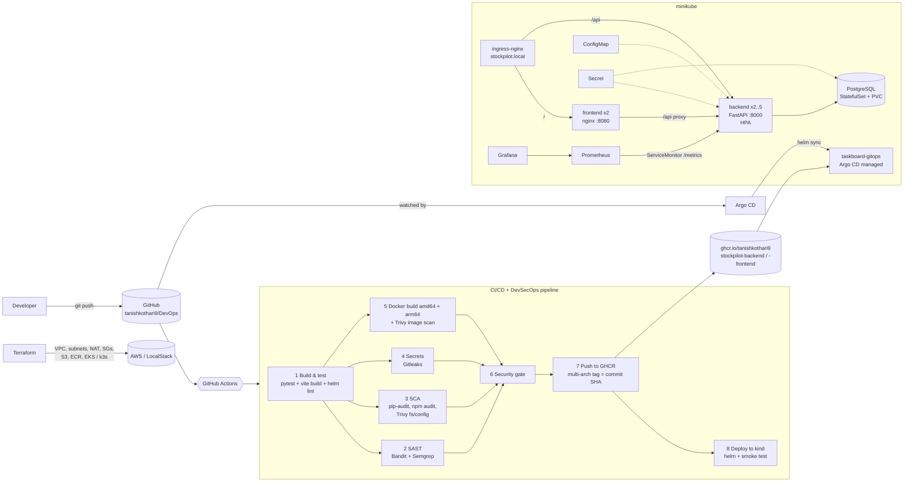
```mermaid
flowchart LR
  dev[Developer] -->|git push| gh[(GitHub<br/>tanishkothari9/DevOps)]
  gh --> ci{{GitHub Actions}}
  subgraph CI["CI/CD + DevSecOps pipeline"]
    direction LR
    t[1 Build & test<br/>pytest + vite build + helm lint] --> sast[2 SAST<br/>Bandit + Semgrep]
    t --> sca[3 SCA<br/>pip-audit, npm audit,<br/>Trivy fs/config]
    t --> sec[4 Secrets<br/>Gitleaks]
    t --> img[5 Docker build amd64 + arm64<br/>+ Trivy image scan]
    sast & sca & sec & img --> gate[6 Security gate]
    gate --> push[7 Push to GHCR<br/>multi-arch tag = commit SHA]
    push --> kind[8 Deploy to kind<br/>helm + smoke test]
  end
  ci --> CI
  push --> ghcr[(ghcr.io/tanishkothari9<br/>stockpilot-backend / -frontend)]
  gh -->|watched by| argo[Argo CD]
  argo -->|helm sync| gitopsns
  ghcr --> gitopsns
  subgraph mk["minikube"]
    ing[ingress-nginx<br/>stockpilot.local] -->|/| fe[frontend x2<br/>nginx :8080]
    ing -->|/api| be[backend x2..5<br/>FastAPI :8000<br/>HPA]
    fe -->|/api proxy| be
    be --> pg[(PostgreSQL<br/>StatefulSet + PVC)]
    cm[ConfigMap] -.-> be
    sc[Secret] -.-> be & pg
    prom[Prometheus] -->|ServiceMonitor /metrics| be
    graf[Grafana] --> prom
    gitopsns[taskboard-gitops<br/>Argo CD managed]
  end
  tf[Terraform] -->|VPC, subnets, NAT, SGs,<br/>S3, ECR, EKS / k3s| aws[(AWS / LocalStack)]
```

```text
                         +--------------------------------- GitHub Actions --------------------------------+
 git push  --> GitHub -->| build-test -> SAST | SCA | Gitleaks | build+Trivy (amd64+arm64) -> GATE -> GHCR |--> kind (helm install + smoke test)
                         +---------------------------------------------------------------------------------+
                                                  | images: ghcr.io/tanishkothari9/stockpilot-{backend,frontend}:<sha> (multi-arch)
                                                  v
 +------------------------------------------ minikube -----------------------------------------+
 |  ingress-nginx (Host: stockpilot.local)                                                     |
 |     |-- /      --> Service stockpilot-frontend --> Deployment (2x nginx-unprivileged)       |
 |     `-- /api   --> Service stockpilot-backend  --> Deployment (2..5x FastAPI, HPA on CPU)   |
 |                                                      | envFrom: ConfigMap + Secret          |
 |                                                      v                                      |
 |                    Service stockpilot-postgres --> StatefulSet postgres:16 + PVC (1Gi)      |
 |  monitoring: ServiceMonitor -> Prometheus -> Grafana dashboard + PrometheusRule alerts      |
 |  argocd: Application stockpilot-gitops (Git -> namespace taskboard-gitops, auto-sync)       |
 +---------------------------------------------------------------------------------------------+
 Terraform --> AWS (VPC, 2 public + 2 private subnets, IGW, NAT, SGs, S3, ECR, EKS)  [run on LocalStack]
```

## 3. Technologies used

| Area | Tools |
|---|---|
| App | Python 3.12, FastAPI 0.142, SQLAlchemy 2.1, Alembic 1.20, psycopg 3, prometheus-fastapi-instrumentator, React 19, Vite 8 |
| Tests | pytest 9 + pytest-cov, FastAPI TestClient, SQLite in-memory, `node --test` |
| Containers | Docker multi-stage builds, `python:3.12-slim` (pip removed), `nginxinc/nginx-unprivileged:1.30-alpine`, docker compose |
| Kubernetes | minikube v1.37, kustomize, ingress-nginx, metrics-server, HPA v2, StatefulSet + PVC |
| Packaging | Helm 3 chart `stockpilot` (with `helm test`) |
| IaC | Terraform 1.16, AWS provider 6.67, LocalStack 3.8 |
| CI/CD | GitHub Actions, GHCR, helm/kind-action, azure/setup-helm |
| DevSecOps | Bandit, Semgrep, pip-audit, npm audit, Trivy 0.75 (fs, config, image; run from the `aquasec/trivy:0.75.0` image), Gitleaks 8.30, actionlint |
| Observability | kube-prometheus-stack (Prometheus Operator, Prometheus, Alertmanager, Grafana), ServiceMonitor, PrometheusRule |
| GitOps | Argo CD (auto-sync, prune, self-heal) |

## 4. Rubric checklist (GRADING.md M1–M10)

| Module | Requirement | Evidence |
|---|---|---|
| **M1** Application | FastAPI `/health`, ≥4 REST endpoints (GET/POST/PUT/DELETE), Postgres + Alembic, React UI making API calls, responsive | [`application/backend/app`](application/backend/app), [`alembic/versions/0001_create_inventory.py`](application/backend/alembic/versions/0001_create_inventory.py), [`application/frontend/src`](application/frontend/src), screenshots 07, 08, 09, 10, 11, 12, 23, 24 |
| **M2** Testing | pytest passes, ≥5 tests over ≥3 endpoints, test DB not prod, `pytest.ini`/`conftest.py` | 13 tests in [`tests/test_api.py`](application/backend/tests/test_api.py), SQLite override in [`tests/conftest.py`](application/backend/tests/conftest.py), [`pytest.ini`](application/backend/pytest.ini), screenshots 01, 53 |
| **M3** Git & GitHub | public repo, meaningful commits, `.gitignore` | https://github.com/tanishkothari9/DevOps, conventional commits (screenshot 87), [`.gitignore`](.gitignore) excludes `.env`, `__pycache__`, `node_modules`, `.venv`, tfstate |
| **M4** Docker | backend Dockerfile, multi-stage frontend (Node → nginx), non-root, `docker compose up --build` | [`backend/Dockerfile`](application/backend/Dockerfile) (UID 10001), [`frontend/Dockerfile`](application/frontend/Dockerfile) (UID 101), [`docker/docker-compose.yml`](docker/docker-compose.yml), screenshots 03, 04, 05, 06, 09, 12 |
| **M5** CI/CD | workflow on push to main, pytest gate, frontend build, both images built, pushed to GHCR, SHA tags | [`.github/workflows/final-devops-project.yml`](.github/workflows/final-devops-project.yml), green runs [#37665562873](https://github.com/tanishkothari9/DevOps/actions/runs/37665562873) and [#37676579566](https://github.com/tanishkothari9/DevOps/actions/runs/37676579566) (multi-arch), screenshots 49–57, 54b–56b, 88 |
| **M6** Trivy | Trivy on both images in CI, fail on HIGH/CRITICAL, explanation | job 5 + job 6 (gate), screenshots 33, 34, 35, 54, 54b, 55, 55b, [explanation](#trivy-what-was-scanned-and-what-the-result-means) |
| **M7** Terraform | valid HCL, init, non-empty plan, VPC + 2 public subnets, EKS + node group, destroy, `terraform.tfvars.example` | [`terraform/`](terraform), screenshots 37–46. EKS is in the plan (39). Apply/destroy ran on LocalStack, where EKS is not available ([details](#8-terraform-infrastructure)) |
| **M8** Kubernetes + Helm | namespace.yaml, chart, `helm upgrade --install`, ≥2 replicas, ClusterIP services, Ingress `/` + `/api`, all pods Running | [`kubernetes/`](kubernetes), [`helm/stockpilot`](helm/stockpilot), screenshots 14–26, 48, 58, 86. 2+2 replicas on minikube (15, 21) and in the CI kind cluster (57). The final minikube footprint was cut to 1 frontend + HPA 1–3 backends to spare the shared node (section 9) |
| **M9** Observability | `/metrics`, Prometheus scraping (target UP), Grafana with live panels | screenshots 60–66 (Prometheus targets 62, alerts 64, Grafana 65), [`monitoring/`](monitoring) |
| **M10** Docs & demo | README + commit → pipeline → deployment update | this README. Commit `7023eeb` → green pipeline → multi-arch GHCR image → commit `6d3fc4c` → Argo CD rollout (section [13](#13-gitops)) |
| Session 21 extras | SAST, SCA, secret scanning, security gate, GitOps, troubleshooting challenge | sections [11](#11-devsecops-implementation), [13](#13-gitops), [14](#14-troubleshooting-final-challenge) |

---

## 5. Application setup

### Run the backend locally

```bash
cd application/backend
python3.12 -m venv .venv && source .venv/bin/activate
pip install -r requirements-dev.txt
export DATABASE_URL='postgresql+psycopg://stockpilot:<password>@localhost:5432/stockpilot'   # see .env.example
alembic upgrade head
uvicorn app.main:app --reload --port 8000        # Swagger at http://localhost:8000/docs
```

Configuration is read from environment variables ([`app/config.py`](application/backend/app/config.py)). Inside Kubernetes the non-secret values (`APP_ENV`, `LOG_LEVEL`, `DB_HOST`, `DB_PORT`, `DB_NAME`) come from a **ConfigMap**, and `DB_USER`/`DB_PASSWORD` come from a **Secret**. `DATABASE_URL` overrides them (compose and tests).

### Tests (quality gate #1)

The test suite overrides the `get_db` dependency with an **in-memory SQLite** database ([`tests/conftest.py`](application/backend/tests/conftest.py)). It never touches the real PostgreSQL. 13 tests cover 12 of the 13 routes: health, readiness, info, create/get, duplicate SKU (409), validation (422), filters, update, stock adjustment and movement audit, negative-stock protection, stats, delete and `/metrics`.

```bash
cd application/backend && pytest -v
```

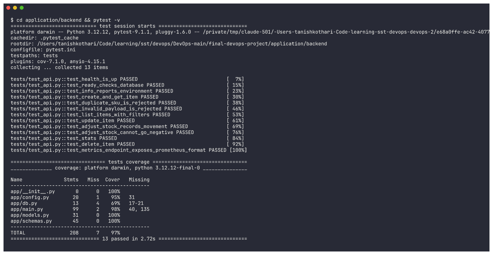

<sub>Full output: [`outputs/01-pytest-coverage.txt`](outputs/01-pytest-coverage.txt)</sub>


Frontend unit tests and production build:

```bash
cd application/frontend && npm ci --no-audit --no-fund && npm test && npm run build
```

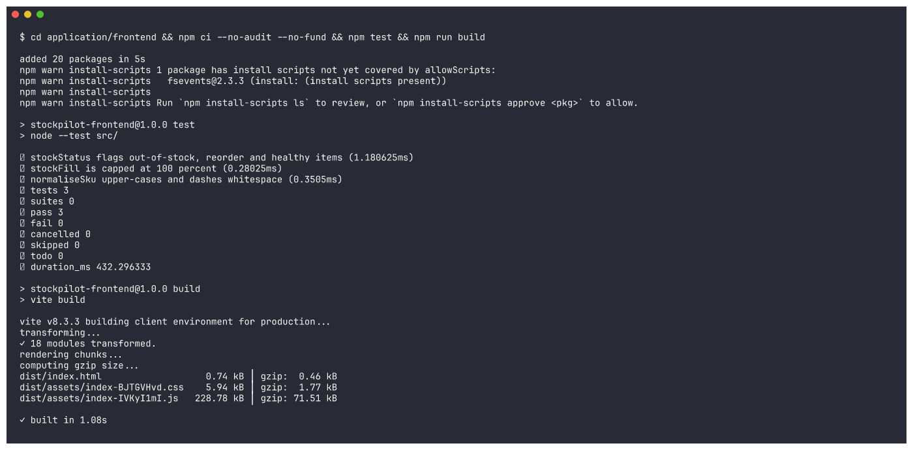

<sub>Full output: [`outputs/02-frontend-test-build.txt`](outputs/02-frontend-test-build.txt)</sub>


FastAPI's generated Swagger UI (`/docs`) lists every route:

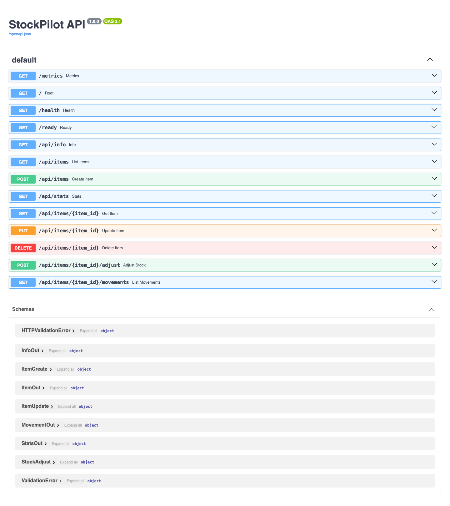

<sub>http://localhost:8010/docs, the FastAPI Swagger UI (docker compose stack)</sub>


## 6. Docker setup

* **Backend** ([Dockerfile](application/backend/Dockerfile)) is a two-stage build. Dependencies go into `/opt/venv` in a build stage. The runtime stage copies only the venv and the code, **removes pip** (see [Trivy before/after](#trivy-before-vs-after-fix)), runs as **UID 10001**, has a `HEALTHCHECK`, and starts with `alembic upgrade head && exec uvicorn ...`. Alembic takes a Postgres **advisory lock**, so two replicas starting together cannot race on migrations.
* **Frontend** ([Dockerfile](application/frontend/Dockerfile)) is also multi-stage: `node:22-alpine` runs `npm ci && npm run build`, and only `dist/` is copied into `nginxinc/nginx-unprivileged:1.30-alpine` (UID 101, port 8080). The nginx config is a template, so `BACKEND_URL` is injected at start-up. That one image works in compose (`http://backend:8000`) and in Kubernetes (`http://stockpilot-backend:8000`).

```bash
docker build --progress=plain -t stockpilot-backend:local application/backend 2>&1 | grep -E '^#[0-9]+ (\[|DONE|naming|writing)|FROM|ERROR' | tail -40
```

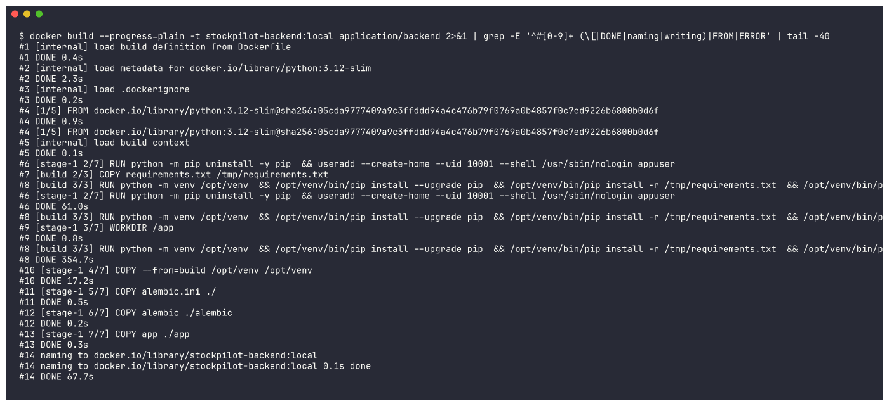

<sub>Full output: [`outputs/03-docker-build-backend.txt`](outputs/03-docker-build-backend.txt)</sub>


```bash
docker build --progress=plain -t stockpilot-frontend:local application/frontend 2>&1 | grep -E '^#[0-9]+ (\[|DONE|naming|writing)|FROM|ERROR|built in' | tail -40
```

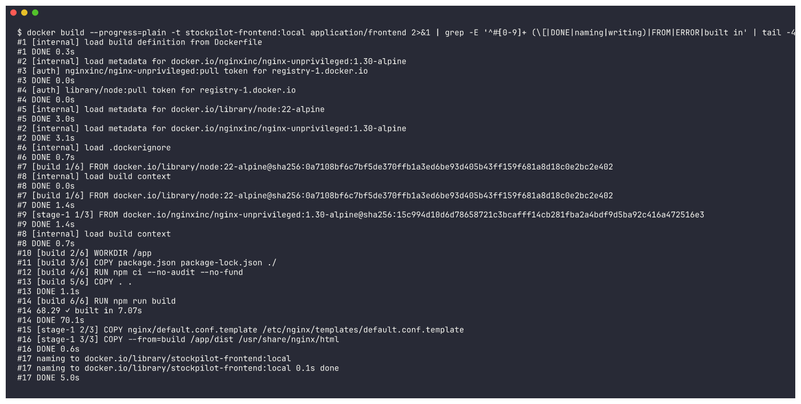

<sub>Full output: [`outputs/04-docker-build-frontend.txt`](outputs/04-docker-build-frontend.txt)</sub>


### docker compose: all three services with one command

[`docker/docker-compose.yml`](docker/docker-compose.yml) starts postgres (with a health check), then the backend (starts once postgres is healthy), then the frontend (starts once the backend is healthy).

```bash
cd docker && docker compose up --build -d 2>&1 | grep -vE '^#|^ *$' | tail -25
```

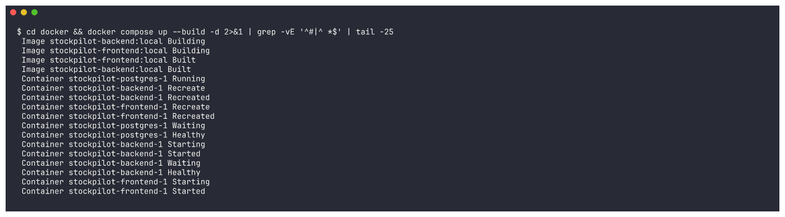

<sub>Full output: [`outputs/05-docker-compose-up.txt`](outputs/05-docker-compose-up.txt)</sub>


```bash
cd docker && docker compose ps && docker compose logs backend --tail 8
```

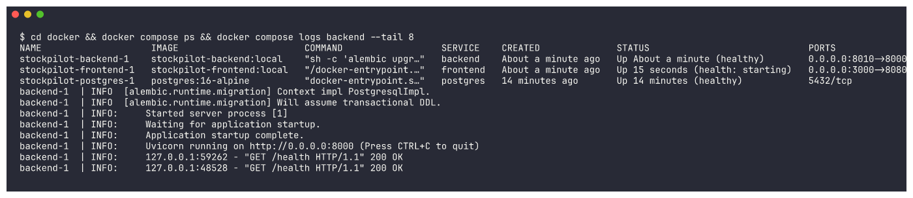

<sub>Full output: [`outputs/06-docker-compose-ps.txt`](outputs/06-docker-compose-ps.txt)</sub>


Seed demo data through the REST API and query it, going directly to the backend (`:8010`) and through the nginx proxy (`:3000/api`):

```bash
BASE_URL=http://localhost:3000 ./scripts/seed.sh && curl -s localhost:8010/health && echo && curl -s localhost:8010/ready && echo && curl -s localhost:3000/api/info && echo && curl -s localhost:3000/api/stats | jq . && curl -s 'localhost:3000/api/items?low_stock=true' | jq -c '.[] | {sku,name,quantity,reorder_level,low_stock}'
```

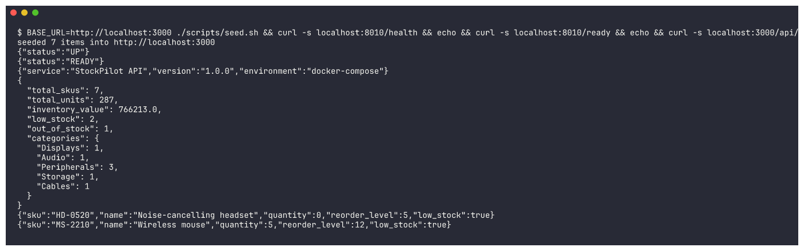

<sub>Full output: [`outputs/07-compose-seed-and-curl.txt`](outputs/07-compose-seed-and-curl.txt)</sub>


Full CRUD and business rules (POST → GET → PUT → adjust rejected with 400 → movements → DELETE 204 → GET 404), plus the Prometheus counters:

```bash
API=localhost:8010/api; curl -s -X POST $API/items -H 'Content-Type: application/json' -d '{"sku":"TMP-001","name":"Demo item","quantity":3,"reorder_level":1,"unit_price":10}' | jq -c '{id,sku,quantity}'; ID=$(curl -s $API/items?q=TMP | jq '.[0].id'); curl -s $API/items/$ID | jq -c '{id,sku,name,location}'; curl -s -X PUT $API/items/$ID -H 'Content-Type: application/json' -d '{"location":"Z-99"}' | jq -c '{id,location}'; curl -s -X POST $API/items/$ID/adjust -H 'Content-Type: application/json' -d '{"delta":-5}' ; echo; curl -s $API/items/$ID/movements | jq -c .; curl -s -o /dev/null -w 'DELETE -> %{http_code}\n' -X DELETE $API/items/$ID; curl -s -o /dev/null -w 'GET after delete -> %{http_code}\n' $API/items/$ID; curl -s localhost:8010/metrics | grep -E '^(http_requests_total|stockpilot_stock_movements_total)' | head -8
```

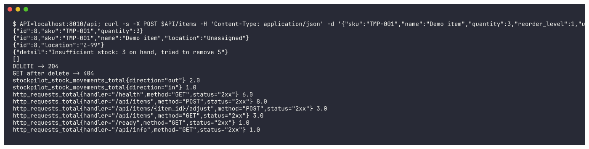

<sub>Full output: [`outputs/08-compose-crud-api.txt`](outputs/08-compose-crud-api.txt)</sub>


Data lives in PostgreSQL (tables created by Alembic) and the backend container runs as a non-root user:

```bash
cd docker && docker compose exec -T postgres psql -U stockpilot -d stockpilot -c '\dt' -c 'select * from alembic_version;' -c 'select sku, name, quantity, reorder_level from items order by sku;' && docker compose exec -T backend id
```

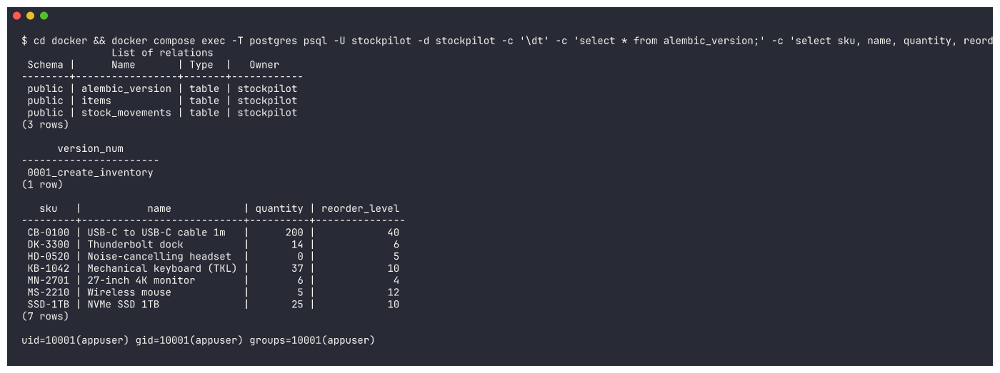

<sub>Full output: [`outputs/12-compose-postgres-tables.txt`](outputs/12-compose-postgres-tables.txt)</sub>


The stack was stopped later (`docker compose down`; the data volume is kept) to free memory for the shared cluster:

```bash
cd docker && docker compose down && docker compose ps -a && docker volume ls | grep stockpilot
```

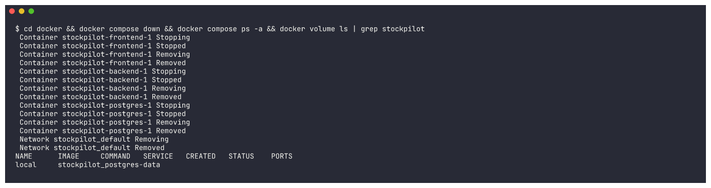

<sub>Full output: [`outputs/12b-compose-down.txt`](outputs/12b-compose-down.txt)</sub>


The UI at http://localhost:3000. Desktop and mobile (390×844, the table collapses into cards):


<sub>StockPilot UI, desktop 1440x900 (docker compose, http://localhost:3000)</sub>


<sub>StockPilot UI, mobile 390x844 (docker compose)</sub>


## 7. Kubernetes deployment

Plain manifests live in [`kubernetes/`](kubernetes) and are applied with kustomize:

| File | Objects | Notes |
|---|---|---|
| `namespace.yaml` | Namespace `taskboard` | Pod Security Admission `warn: baseline` |
| `configmap.yaml` | ConfigMap `stockpilot-config` | APP_ENV, LOG_LEVEL, DB_HOST/PORT/NAME |
| `secret.yaml` | Secret `stockpilot-db` | **dummy** dev credentials (real ones belong in Sealed Secrets / External Secrets) |
| `postgres.yaml` | PVC (1Gi) + Service + StatefulSet | runs as UID 70, read-only root FS, `pg_isready` readiness/liveness |
| `backend.yaml` | Deployment (2) + ClusterIP Service | init container waits for Postgres. **startup** `/health`, **readiness** `/ready` (DB check), **liveness** `/health`. CPU/memory requests and limits, non-root, read-only root FS, drop ALL capabilities |
| `frontend.yaml` | Deployment (2) + ClusterIP Service | `/healthz` probes, read-only root FS (emptyDirs for `/tmp`, `/etc/nginx/conf.d`) |
| `ingress.yaml` | Ingress `stockpilot.local` | `/api` → backend:8000, `/` → frontend:80 |
| `hpa.yaml` | HPA autoscaling/v2 | 2–5 backend pods at 60% CPU |

The images are built locally and loaded into minikube (no registry needed for the local cluster):

```bash
minikube image load stockpilot-backend:local && minikube image load stockpilot-frontend:local && minikube image ls | grep -E 'stockpilot|postgres:16'
```

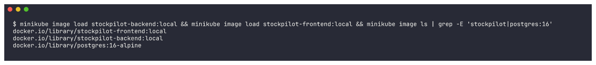

<sub>Full output: [`outputs/13-minikube-image-load.txt`](outputs/13-minikube-image-load.txt)</sub>


```bash
kubectl apply -f kubernetes/namespace.yaml && kubectl apply -k kubernetes/ && kubectl rollout status deploy/stockpilot-backend -n taskboard --timeout=240s && kubectl rollout status deploy/stockpilot-frontend -n taskboard --timeout=120s
```

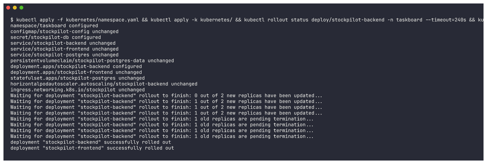

<sub>Full output: [`outputs/14-kubectl-apply-manifests.txt`](outputs/14-kubectl-apply-manifests.txt)</sub>


```bash
kubectl get all,ing,hpa,pvc,cm,secret -n taskboard
```

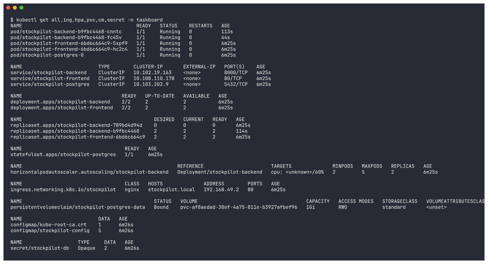

<sub>Full output: [`outputs/15-k8s-manifests-resources.txt`](outputs/15-k8s-manifests-resources.txt)</sub>


The ingress-nginx controller is exposed on the laptop with `kubectl port-forward svc/ingress-nginx-controller -n ingress-nginx 8082:80`, and requests carry `Host: stockpilot.local`:

```bash
BASE_URL=http://localhost:8082 HOST_HEADER=stockpilot.local ./scripts/seed.sh && curl -s -H 'Host: stockpilot.local' localhost:8082/api/info && echo && curl -s -H 'Host: stockpilot.local' localhost:8082/api/stats | jq -c . && curl -s -o /dev/null -w 'GET / (frontend via ingress) -> %{http_code}\n' -H 'Host: stockpilot.local' localhost:8082/
```

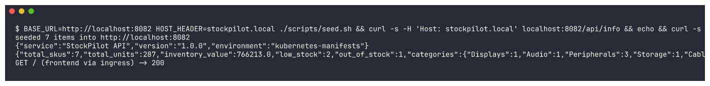

<sub>Full output: [`outputs/16-k8s-manifests-ingress-curl.txt`](outputs/16-k8s-manifests-ingress-curl.txt)</sub>


The raw manifests were then removed so that Helm could own the same resources (section 9):

```bash
kubectl delete -k kubernetes/ --wait=true && kubectl get all -n taskboard
```

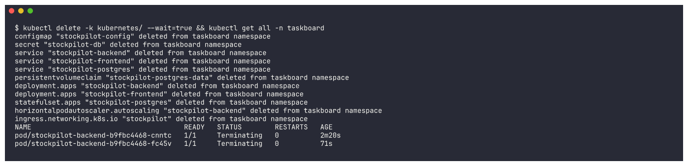

<sub>Full output: [`outputs/17-kubectl-delete-manifests.txt`](outputs/17-kubectl-delete-manifests.txt)</sub>


## 8. Terraform infrastructure

[`terraform/`](terraform) describes the AWS foundation for running StockPilot:

| File | Resources |
|---|---|
| `network.tf` | VPC `10.20.0.0/16`, **2 public + 2 private subnets in 2 AZs** (with the `kubernetes.io/role/elb` tags), Internet Gateway, NAT Gateway + EIP, public and private route tables |
| `security.tf` | ingress SG (80/443 only), nodes SG (NodePorts only from the ingress SG, node-to-node, 6443 from admin CIDRs) |
| `storage.tf` | S3 artefacts bucket (versioning, SSE, public-access block, lifecycle), ECR repositories (immutable tags, scan on push) |
| `eks.tf` | IAM roles, KMS key for secrets encryption, **EKS cluster** (private endpoint by default, control-plane logs) + **managed node group** in the private subnets |
| `compute.tf` | optional single EC2 host that installs k3s on boot (IMDSv2 only, encrypted gp3). This is the low-cost / LocalStack substitute for EKS |
| `providers.tf` | one `aws` provider with a **`use_localstack`** switch (dummy creds `test/test`, `skip_*` flags, `s3_use_path_style`, endpoints → `http://localhost:4566`) |
| `terraform.tfvars.example` | real-AWS variables, no credentials (git-ignores `terraform.tfvars` and all state) |

> **Honest note:** no AWS account or credentials exist on this machine. So `apply` and `destroy` ran against **LocalStack 3.8 community** (`localstack.tfvars`). LocalStack community does not include EKS or ECR, so for the apply `enable_eks=false`, `enable_ecr=false` and the k3s EC2 host is the Kubernetes substitute. The **EKS cluster + node group + ECR are still validated and planned** (screenshot 39: 40 resources including `aws_eks_cluster` and `aws_eks_node_group`). To deploy on real AWS: `aws configure` (or SSO), `cp terraform.tfvars.example terraform.tfvars`, `terraform apply`. `use_localstack` defaults to `false`.

```bash
cd terraform && terraform init -input=false
```

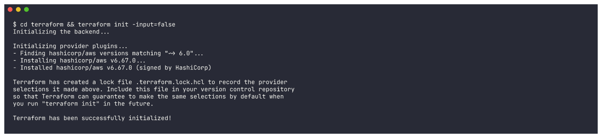

<sub>Full output: [`outputs/37-terraform-init.txt`](outputs/37-terraform-init.txt)</sub>


```bash
cd terraform && terraform fmt -recursive -check -diff && echo 'terraform fmt: all files formatted' && terraform validate
```

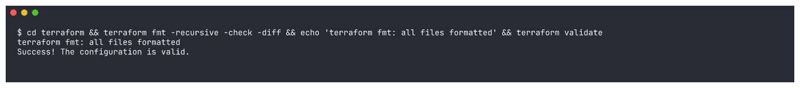

<sub>Full output: [`outputs/38-terraform-fmt-validate.txt`](outputs/38-terraform-fmt-validate.txt)</sub>


Plan of the real-AWS shape (EKS + node group + ECR), planned against LocalStack's API:

```bash
cd terraform && terraform plan -input=false -var-file=localstack.tfvars -var use_localstack=true -var enable_eks=true -var enable_ecr=true -var enable_k3s_node=false -no-color | grep -E '^  # |^Plan:'
```

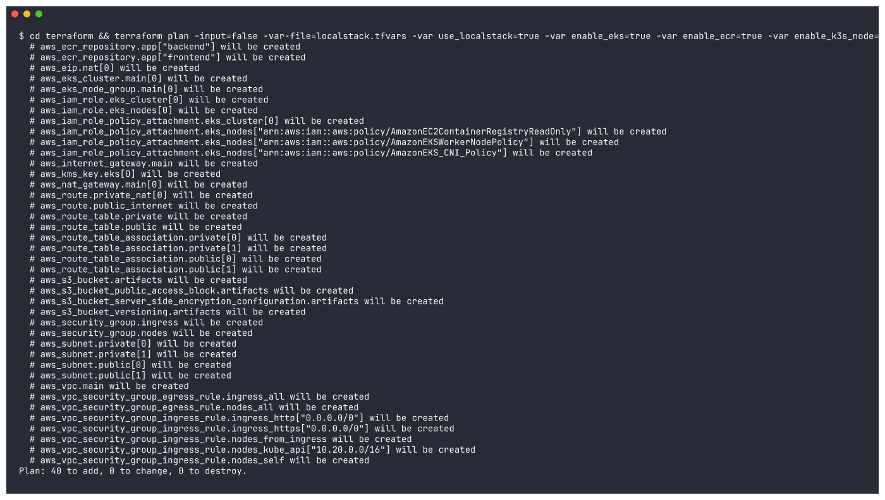

<sub>Full output: [`outputs/39-terraform-plan-eks-preview.txt`](outputs/39-terraform-plan-eks-preview.txt)</sub>


Plan and apply of the LocalStack variant (VPC, 4 subnets, IGW, NAT, routes, SGs, S3, k3s EC2 host):

```bash
cd terraform && terraform plan -input=false -var-file=localstack.tfvars -out=localstack.tfplan -no-color | grep -E '^  # |^Plan:|Saved the plan'
```

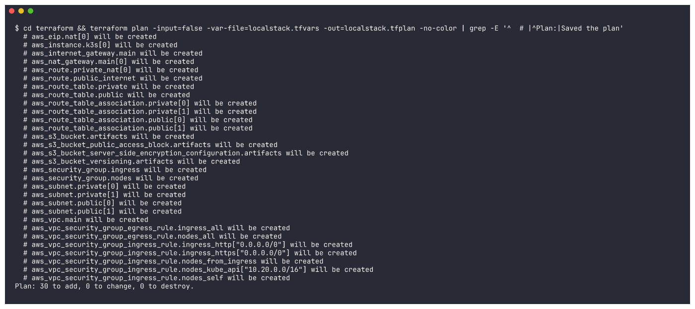

<sub>Full output: [`outputs/40-terraform-plan-localstack.txt`](outputs/40-terraform-plan-localstack.txt)</sub>


```bash
cd terraform && terraform apply -input=false -auto-approve localstack.tfplan -no-color | grep -E 'Creation complete|Apply complete|Error'
```

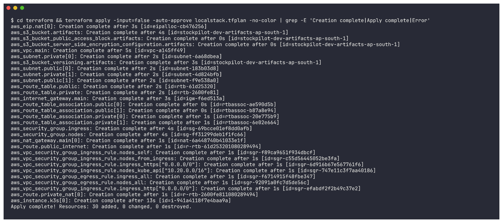

<sub>Full output: [`outputs/41-terraform-apply-localstack.txt`](outputs/41-terraform-apply-localstack.txt)</sub>


```bash
cd terraform && terraform output
```

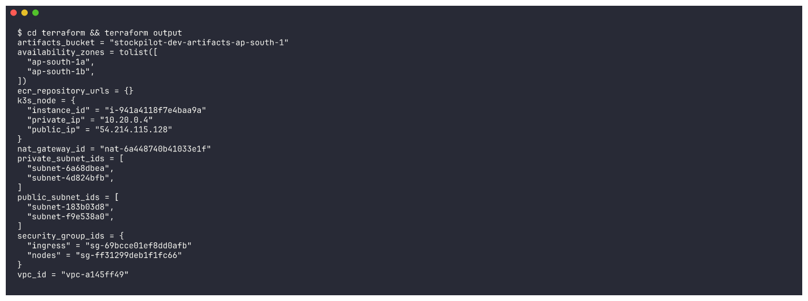

<sub>Full output: [`outputs/42-terraform-output.txt`](outputs/42-terraform-output.txt)</sub>


```bash
cd terraform && terraform state list
```

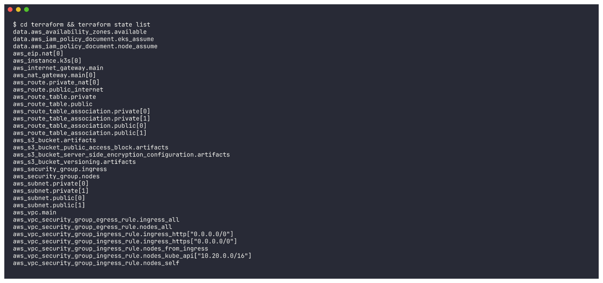

<sub>Full output: [`outputs/43-terraform-state-list.txt`](outputs/43-terraform-state-list.txt)</sub>


Independent check with the AWS CLI against the LocalStack endpoint. The terminated instance is left over from a first, partially failed apply (see Lessons learned):

```bash
export AWS_ACCESS_KEY_ID=test AWS_SECRET_ACCESS_KEY=test AWS_DEFAULT_REGION=ap-south-1; A='aws --endpoint-url http://localhost:4566'; $A ec2 describe-vpcs --filters Name=tag:Project,Values=stockpilot --query 'Vpcs[].[VpcId,CidrBlock,Tags[?Key==`Name`]|[0].Value]' --output table && $A ec2 describe-subnets --filters Name=tag:Project,Values=stockpilot --query 'Subnets[].[SubnetId,CidrBlock,AvailabilityZone,Tags[?Key==`Tier`]|[0].Value]' --output table && $A ec2 describe-instances --filters Name=tag:Project,Values=stockpilot --query 'Reservations[].Instances[].[InstanceId,InstanceType,State.Name,PublicIpAddress]' --output table && $A s3api list-buckets --query 'Buckets[?contains(Name,`stockpilot`)].Name' --output table
```

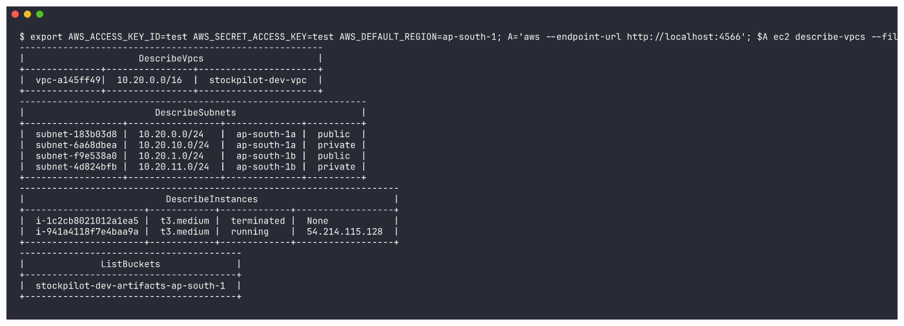

<sub>Full output: [`outputs/44-localstack-verify-aws-cli.txt`](outputs/44-localstack-verify-aws-cli.txt)</sub>


A second plan right after apply is **not** empty. It shows emulator drift, not real drift: LocalStack does not store `metadata_options` and returns SG references with an account prefix. On real AWS the same plan is empty.

```bash
cd terraform && terraform plan -input=false -var-file=localstack.tfvars -no-color -detailed-exitcode | grep -E '^  # |^Plan:|No changes|~ |http_tokens'; echo "plan exit code: ${PIPESTATUS[0]}"
```

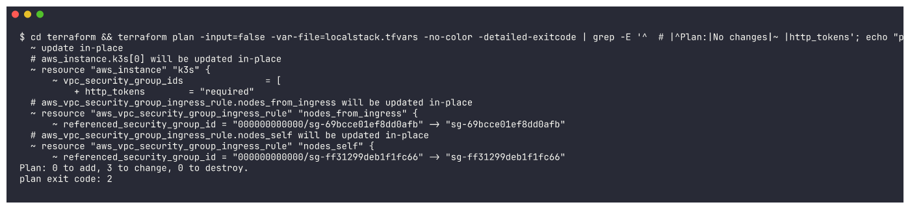

<sub>Full output: [`outputs/45-terraform-plan-after-apply.txt`](outputs/45-terraform-plan-after-apply.txt)</sub>


```bash
cd terraform && terraform destroy -input=false -auto-approve -var-file=localstack.tfvars -no-color | grep -E 'Destruction complete|Destroy complete|Error' | tail -12 && terraform state list | wc -l | xargs echo 'resources left in state:'
```

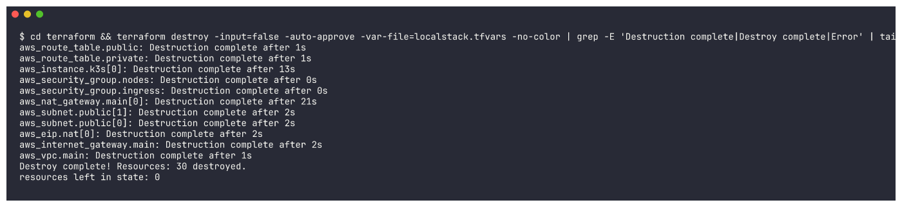

<sub>Full output: [`outputs/46-terraform-destroy.txt`](outputs/46-terraform-destroy.txt)</sub>


## 9. Helm deployment

Chart [`helm/stockpilot`](helm/stockpilot) packages all of the above with templated names and labels. It adds:

* `values.yaml` (defaults: GHCR images, 2+2 replicas, HPA 2–5, ingress, monitoring on), `values-local.yaml` (minikube: local images, `pullPolicy: Never`), `values-ci.yaml` (kind: GHCR pull secret, no ingress or monitoring CRDs)
* `checksum/config` and `checksum/secret` pod annotations, so a config change rolls the pods
* ServiceMonitor, PrometheusRule (5 alerts) and a Grafana-dashboard ConfigMap (`grafana_dashboard: "1"`)
* `templates/tests/test-api.yaml`, a `helm test` smoke test (backend `/ready`, frontend `/api/info` proxy, frontend `/healthz`)

```bash
helm lint helm/stockpilot -f helm/stockpilot/values-local.yaml && helm template stockpilot helm/stockpilot -n taskboard -f helm/stockpilot/values-local.yaml | grep -E '^kind:' | sort | uniq -c
```

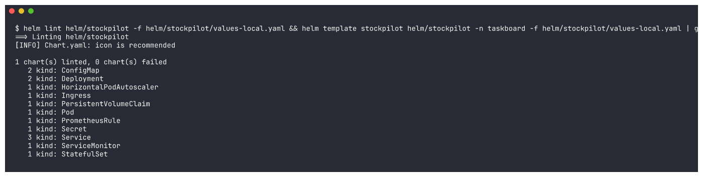

<sub>Full output: [`outputs/18-helm-lint-template.txt`](outputs/18-helm-lint-template.txt)</sub>


```bash
helm upgrade --install stockpilot helm/stockpilot -n taskboard -f helm/stockpilot/values-local.yaml --wait --timeout 6m
```

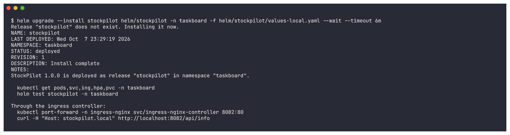

<sub>Full output: [`outputs/19-helm-install.txt`](outputs/19-helm-install.txt)</sub>


```bash
helm list -n taskboard && helm test stockpilot -n taskboard --logs
```

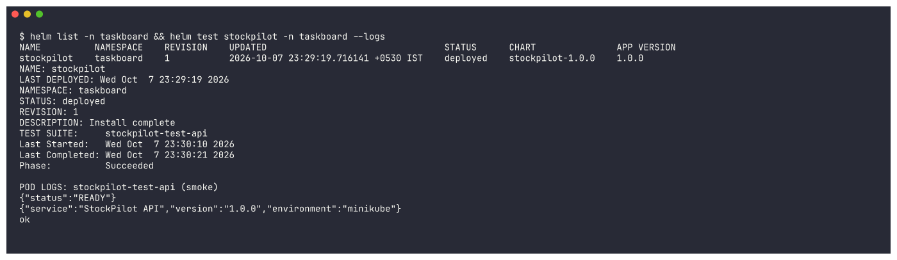

<sub>Full output: [`outputs/20-helm-list-and-test.txt`](outputs/20-helm-list-and-test.txt)</sub>


```bash
kubectl get all,ing,hpa,pvc,cm,secret -n taskboard -o wide
```

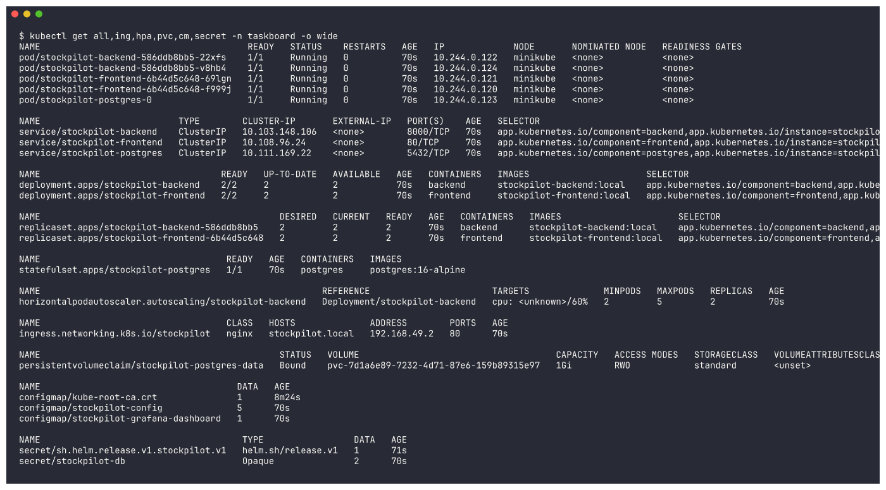

<sub>Full output: [`outputs/21-helm-k8s-resources.txt`](outputs/21-helm-k8s-resources.txt)</sub>


```bash
BASE_URL=http://localhost:8082 HOST_HEADER=stockpilot.local ./scripts/seed.sh; kubectl get ingress stockpilot -n taskboard && curl -s -H 'Host: stockpilot.local' localhost:8082/api/info && echo && curl -s -H 'Host: stockpilot.local' 'localhost:8082/api/items?low_stock=true' | jq -c '.[] | {sku,quantity,reorder_level}' && curl -s -H 'Host: stockpilot.local' localhost:8082/ | head -c 300; echo
```

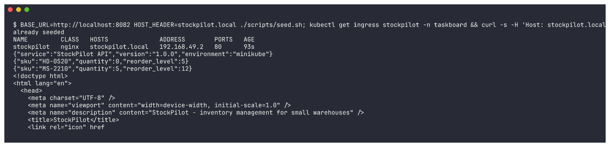

<sub>Full output: [`outputs/22-helm-ingress-curl.txt`](outputs/22-helm-ingress-curl.txt)</sub>


The app opened **through the Ingress hostname** (`http://stockpilot.local:8082`, with `stockpilot.local` resolved to the port-forwarded ingress controller):

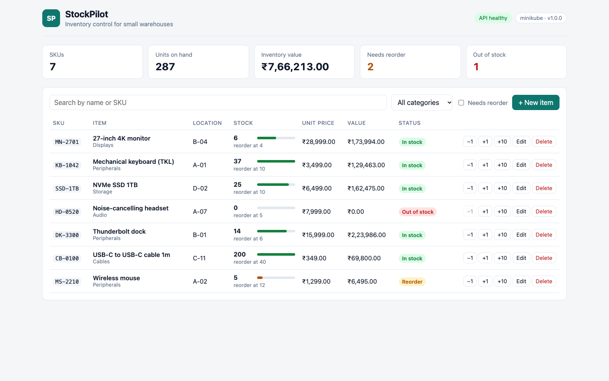

<sub>StockPilot through ingress-nginx, Host stockpilot.local (desktop)</sub>


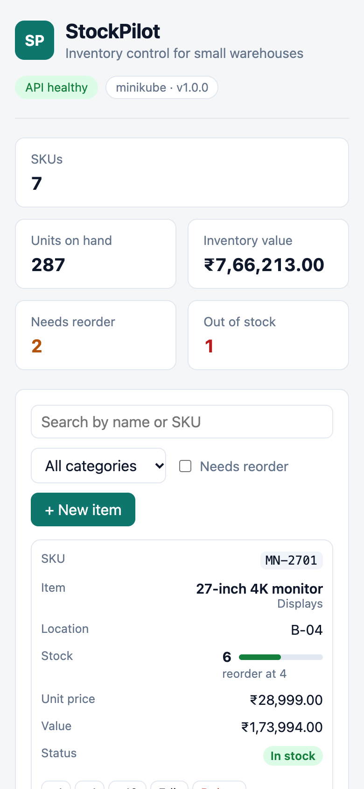

<sub>StockPilot through ingress-nginx, Host stockpilot.local (mobile)</sub>


### ConfigMap, Secret, probes, resources

```bash
kubectl get deploy stockpilot-backend -n taskboard -o json | jq '.spec.template.spec.containers[0] | {image, envFrom, startupProbe, readinessProbe, livenessProbe, resources, securityContext}' && kubectl get configmap stockpilot-config -n taskboard -o jsonpath='{.data}' | jq -c . && kubectl get secret stockpilot-db -n taskboard -o json | jq -c '.data | map_values("<redacted base64>")'
```

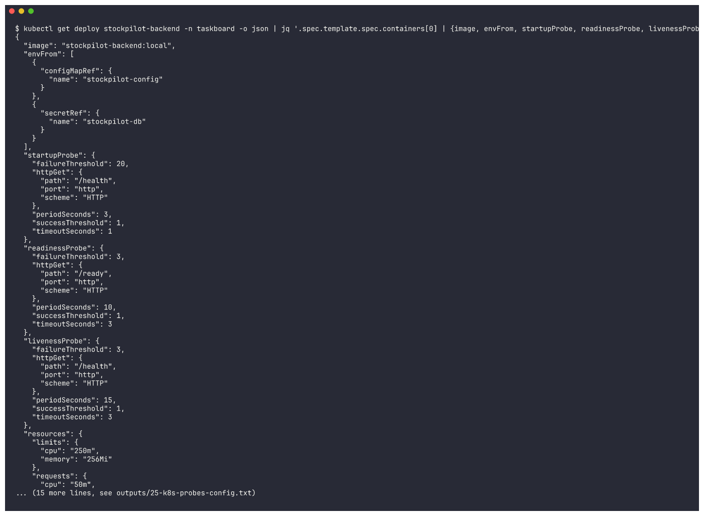

<sub>Full output: [`outputs/25-k8s-probes-config.txt`](outputs/25-k8s-probes-config.txt)</sub>


### Storage: data survives a Postgres pod restart (PVC)

```bash
curl -s -H 'Host: stockpilot.local' localhost:8082/api/stats | jq -c '{total_skus,total_units}' && kubectl delete pod stockpilot-postgres-0 -n taskboard && sleep 5 && kubectl get pods -n taskboard && curl -s -o /dev/null -w 'API while the DB pod restarts -> HTTP %{http_code}\n' -H 'Host: stockpilot.local' localhost:8082/api/stats; kubectl wait --for=condition=Ready pod/stockpilot-postgres-0 -n taskboard --timeout=120s && kubectl wait --for=condition=Ready pod -l app.kubernetes.io/component=backend -n taskboard --timeout=120s && sleep 3 && kubectl get pvc,pod -n taskboard && curl -s -H 'Host: stockpilot.local' localhost:8082/api/stats | jq -c '{total_skus,total_units}'
```

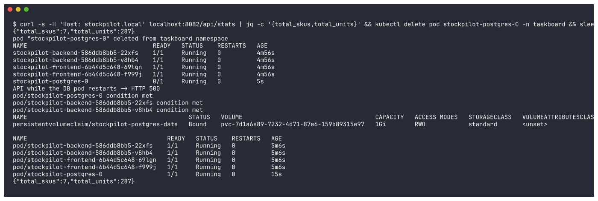

<sub>Full output: [`outputs/26-pvc-persistence.txt`](outputs/26-pvc-persistence.txt)</sub>


### Helm upgrade: hardening Postgres

`trivy config` flagged the Postgres container as running with the default (root-capable) security context (section 11). The chart was changed to run Postgres as UID 70 with a read-only root filesystem, and probe timeouts were relaxed after the shared node overloaded (see Lessons learned). The local values were also reduced to 1 frontend replica and an HPA range of 1–3 backends, to spare the shared, memory-constrained node. Revisions 2 and 3 failed because the ingress-nginx admission webhook was unreachable while the node was overloaded. Revision 4 went through once the node recovered:

```bash
helm upgrade stockpilot helm/stockpilot -n taskboard -f helm/stockpilot/values-local.yaml --wait --timeout 10m | head -7 && kubectl exec -n taskboard stockpilot-postgres-0 -- id && kubectl get sts stockpilot-postgres -n taskboard -o jsonpath='{.spec.template.spec.securityContext}{"\n"}{.spec.template.spec.containers[0].securityContext}{"\n"}' && kubectl get pods,hpa -n taskboard && helm history stockpilot -n taskboard --max 4 | cut -c1-120
```

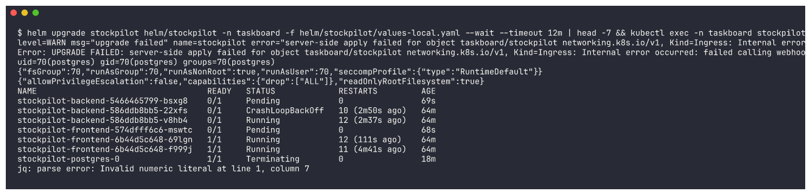

<sub>Full output: [`outputs/48-helm-upgrade-postgres-hardening.txt`](outputs/48-helm-upgrade-postgres-hardening.txt)</sub>


### HPA under load

The backend HPA (`autoscaling/v2`, target 60% of the 50m CPU request) was tested with [`scripts/load-test.sh`](scripts/load-test.sh): 20 parallel curl loops against `/api/stats` and `/api/items` through the Ingress for 120 s. To keep the shared node light, the local values run the HPA at 1–3 replicas. The chart default is 2–5.

```bash
kubectl get hpa stockpilot-backend -n taskboard; (for i in $(seq 1 8); do sleep 15; echo "[$(date +%T)] $(kubectl get hpa stockpilot-backend -n taskboard --no-headers | awk '{print "cpu="$4, "replicas="$7}')"; done) & DURATION=120 CONCURRENCY=20 BASE_URL=http://localhost:8082 HOST_HEADER=stockpilot.local ./scripts/load-test.sh; wait; kubectl top pods -n taskboard -l app.kubernetes.io/component=backend; kubectl get pods -n taskboard -l app.kubernetes.io/component=backend
```

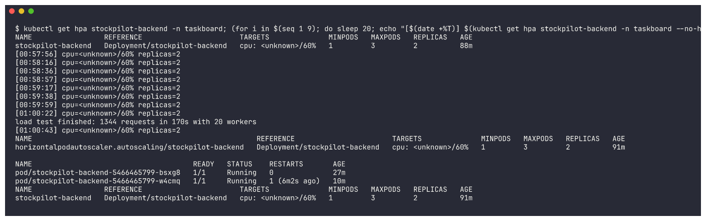

<sub>Full output: [`outputs/58-hpa-load-test.txt`](outputs/58-hpa-load-test.txt)</sub>


The HPA scaled the backend **1 → 2 → 3** (the maximum) within about 90 seconds of the load starting. The events show the controller's reasoning:

```bash
kubectl describe hpa stockpilot-backend -n taskboard | sed -n '/Conditions:/,$p' | cut -c1-200; kubectl get hpa stockpilot-backend -n taskboard
```

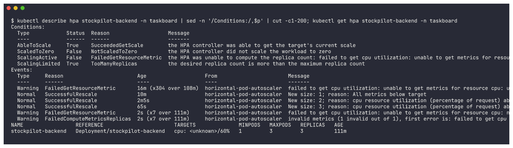

<sub>Full output: [`outputs/59b-hpa-scale-events.txt`](outputs/59b-hpa-scale-events.txt)</sub>


**What happened on the first attempt:** the first load test ran while the shared node was overloaded by other sessions' workloads (load average above 150, swap full). metrics-server was crash-looping, so the Metrics API had no endpoints and the HPA could not compute anything (`ScalingActive=False / FailedGetResourceMetric`). That is a good reminder that an HPA is only as reliable as its metrics pipeline. Both captures are kept:

```bash
kubectl get hpa stockpilot-backend -n taskboard; (for i in $(seq 1 9); do sleep 20; echo "[$(date +%T)] $(kubectl get hpa stockpilot-backend -n taskboard --no-headers | awk '{print "cpu="$4, "replicas="$7}')"; done) & DURATION=170 CONCURRENCY=20 BASE_URL=http://localhost:8082 HOST_HEADER=stockpilot.local ./scripts/load-test.sh; wait; kubectl get hpa,pods -n taskboard -l app.kubernetes.io/component=backend; kubectl get hpa stockpilot-backend -n taskboard
```


<sub>Full output: [`outputs/58a-hpa-load-test-during-overload.txt`](outputs/58a-hpa-load-test-during-overload.txt)</sub>


```bash
kubectl describe hpa stockpilot-backend -n taskboard | sed -n '/Metrics:/,$p' | cut -c1-220; kubectl get apiservice v1beta1.metrics.k8s.io; kubectl get pods -n kube-system -l k8s-app=metrics-server; kubectl top pods -n taskboard; docker exec minikube cat /proc/loadavg
```

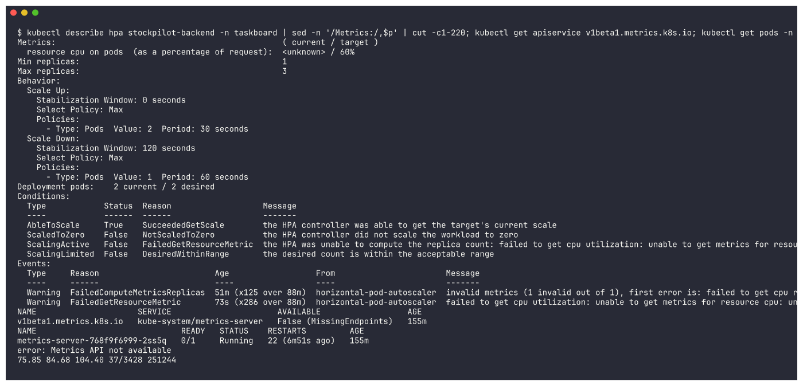

<sub>Full output: [`outputs/59-hpa-metrics-investigation.txt`](outputs/59-hpa-metrics-investigation.txt)</sub>


## 10. CI/CD pipeline

The live workflow is [`.github/workflows/final-devops-project.yml`](https://github.com/tanishkothari9/DevOps/blob/main/.github/workflows/final-devops-project.yml) at the repository root. A reference copy is in [`.github/workflows/`](.github/workflows/final-devops-project.yml). It runs on `push` to `main` (with a `paths:` filter for this folder and the workflow file), on pull requests (without push/deploy), and on `workflow_dispatch`. Every path goes through `PROJECT_DIR`, so the standalone repository only needs `PROJECT_DIR: .` and a shorter `paths:` prefix. The first runs below used a single amd64 build. The final multi-arch version is at the end of this section.

| # | Job | What it does | Fails the pipeline when |
|---|---|---|---|
| 1 | Build & test | `pip install`, **pytest** (coverage + JUnit XML artefacts), `npm ci`, `npm test`, **vite build**, `helm lint` | any test fails or the build breaks |
| 2 | SAST | **Bandit** (MEDIUM+), **Semgrep** (`p/python`, `p/javascript`, `p/react`, `p/dockerfile`) | any finding |
| 3 | SCA | **pip-audit** (strict), **npm audit** (HIGH+), **Trivy fs** (lockfiles + secrets), **Trivy config** (IaC report) | a known-vulnerable dependency with a fix available |
| 4 | Secret scan | **Gitleaks** on the project folder *and* on its git history | a secret is found |
| 5 | Docker build + image scan (matrix: amd64 on `ubuntu-latest`, arm64 on `ubuntu-24.04-arm`) | builds both images natively, tagged **`<sha>-<arch>`**, **Trivy image** scan (JSON report), saves the exact images as an artefact | build errors |
| 6 | **Security gate** | runs even if jobs 2–5 fail (`if: always()`), requires all four to succeed, and re-checks the Trivy JSON for 0 fixable HIGH/CRITICAL. Writes a summary table | any check failed, so nothing is pushed |
| 7 | Push to GHCR | `docker load` of the *scanned* images, push the per-arch tags, then `docker buildx imagetools create` one multi-arch **`ghcr.io/tanishkothari9/stockpilot-{backend,frontend}:<sha>`** using `GITHUB_TOKEN` (`packages: write`), verify via the registry API | push errors |
| 8 | Deploy to Kubernetes | ephemeral **kind** cluster (`helm/kind-action`), pull secret from `GITHUB_TOKEN`, `helm upgrade --install` with the **SHA tag**, rollout status, `helm test`, curl `/health`, `/ready`, POST an item, `/api/stats`. Dumps diagnostics on failure | rollout or smoke test fails |

Supply-chain note: `aquasecurity/trivy-action` and `setup-trivy` (and Trivy 0.69.4–0.69.6) were compromised in March 2026. So Trivy runs from the pinned `aquasec/trivy:0.75.0` image. No repository secrets are used; only the built-in `GITHUB_TOKEN`.

```bash
docker run --rm -v "$PWD:/repo" --workdir /repo rhysd/actionlint:latest .github/workflows/final-devops-project.yml && echo 'actionlint: no problems found' && grep -E '^  [a-z-]+:$|name: "[0-9]' .github/workflows/final-devops-project.yml
```

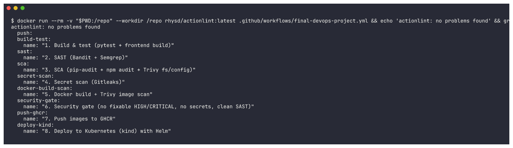

<sub>Full output: [`outputs/36-actionlint-workflow.txt`](outputs/36-actionlint-workflow.txt)</sub>


### A green run: all 8 jobs (single-arch version)

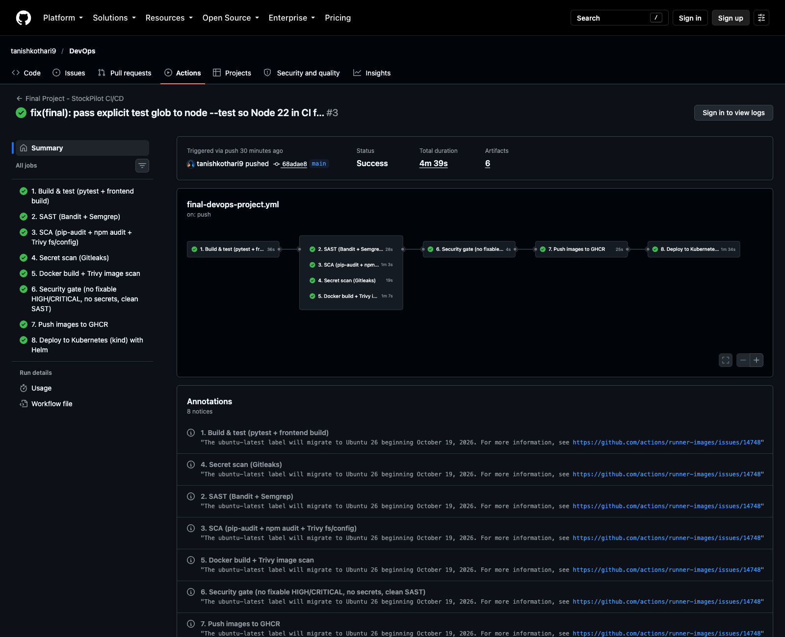

<sub>https://github.com/tanishkothari9/DevOps/actions/runs/37665562873, all jobs green, job graph</sub>


### The gate in action: a failing test stops the pipeline

The first run had a frontend test-runner bug (`node --test src/` works on Node 26 but not Node 22). Build & test failed, the security gate failed, and **push and deploy were skipped**, so no image was published. The fix was commit `68adae8`.

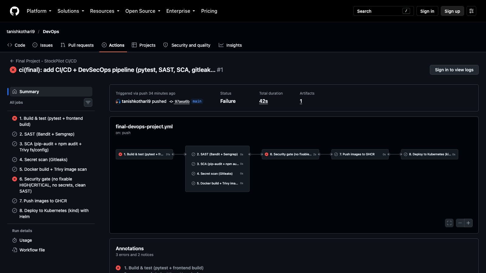

<sub>Run 37665137137: build-test failed, gate failed, push and deploy skipped</sub>


### Pipeline logs

```bash
gh run view -R tanishkothari9/DevOps --log --job 112943750050 | cut -f3 | sed -E 's/^[0-9T:.Z-]+ //; s/\^\[\[[0-9;]*m//g; s/\x1b\[[0-9;]*m//g' | grep -E 'PASSED|passed in|TOTAL|^# (tests|pass|fail) [0-9]|built in|chart\(s\) linted' | head -30
```

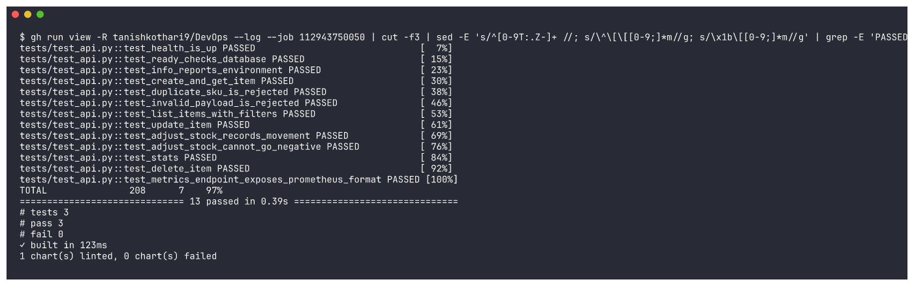

<sub>Full output: [`outputs/53-ci-log-pytest.txt`](outputs/53-ci-log-pytest.txt)</sub>


```bash
gh run view -R tanishkothari9/DevOps --log --job 112944610323 | cut -f3 | sed -E 's/^[0-9T:.Z-]+ //' | grep -E 'Loaded image|digest:|== ghcr|Name:|Digest:|\{"name"|Login Succeeded' | head -20
```

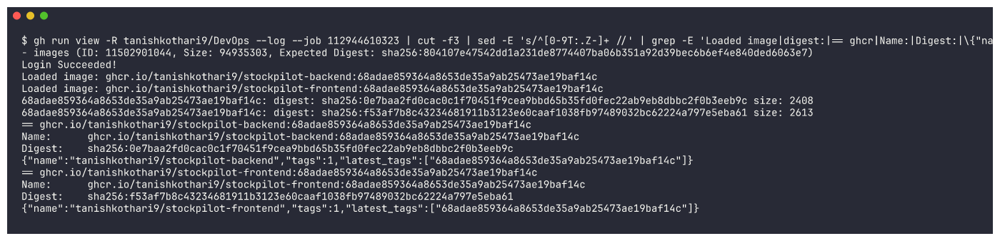

<sub>Full output: [`outputs/56-ci-log-push-ghcr.txt`](outputs/56-ci-log-push-ghcr.txt)</sub>


```bash
gh run view -R tanishkothari9/DevOps --log --job 112945080536 | cut -f3 | sed -E 's/^[0-9T:.Z-]+ //; s/\^\[\[[0-9;]*m//g; s/\x1b\[[0-9;]*m//g' | grep -E 'Creating cluster|Ready after|STATUS: deployed|successfully rolled out|Phase:|\{"status"|service"|ghcr.io/tanishkothari9|^pod/|^deployment.apps/|^persistentvolumeclaim/|^horizontalpodautoscaler' | grep -vE 'set |_IMAGE:' | cut -c1-180 | head -40
```

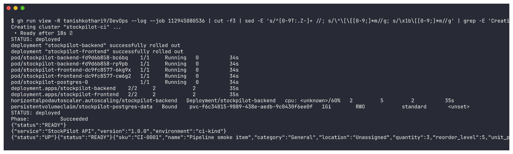

<sub>Full output: [`outputs/57-ci-log-deploy-kind.txt`](outputs/57-ci-log-deploy-kind.txt)</sub>


### Images in GHCR (SHA tags, public packages)

```bash
for img in stockpilot-backend stockpilot-frontend; do T=$(curl -s "https://ghcr.io/token?scope=repository:tanishkothari9/$img:pull" | jq -r .token); curl -s -H "Authorization: Bearer $T" https://ghcr.io/v2/tanishkothari9/$img/tags/list | jq -c .; done; docker pull ghcr.io/tanishkothari9/stockpilot-frontend:68adae859364a8653de35a9ab25473ae19baf14c | tail -2; docker images --format 'table {{.Repository}}\t{{.Tag}}\t{{.Size}}' | grep -E 'REPOSITORY|ghcr.io/tanishkothari9/stockpilot'
```

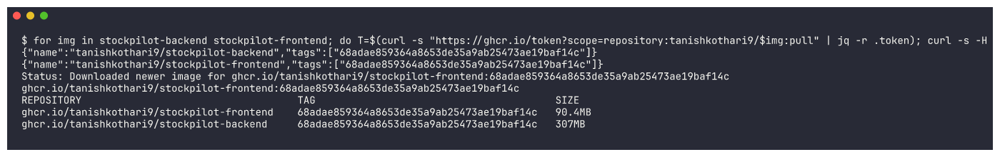

<sub>Full output: [`outputs/49-ghcr-images.txt`](outputs/49-ghcr-images.txt)</sub>


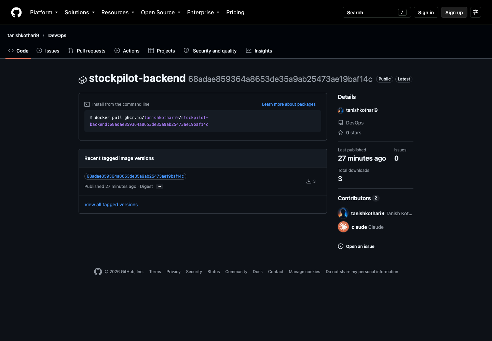

<sub>https://github.com/users/tanishkothari9/packages/container/package/stockpilot-backend, SHA tag, public</sub>


### Final pipeline: multi-arch build (amd64 + arm64)

After the GitOps finding in section 13, job 5 became a matrix that builds natively on amd64 and arm64 runners. Run [#37676579566](https://github.com/tanishkothari9/DevOps/actions/runs/37676579566) is green end to end:

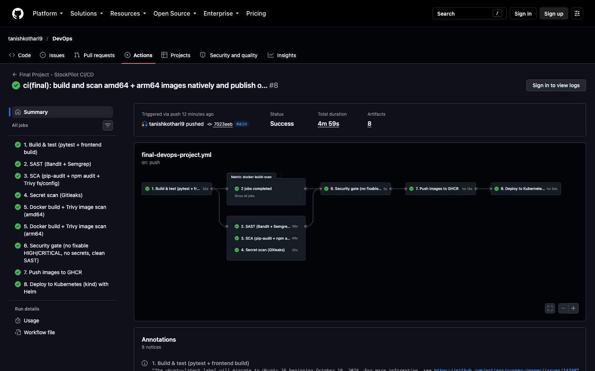

<sub>Run 37676579566: matrix build (amd64 + arm64), gate, push, kind deploy, all green</sub>


```bash
gh run view -R tanishkothari9/DevOps --log --job 112981780253 | cut -f3 | sed -E 's/^[0-9T:.Z-]+ //; s/\^\[\[[0-9;]*m//g; s/\x1b\[[0-9;]*m//g' | grep -E '^arm64$|^Report Summary|│ ghcr|│ [0-9a-f]{6}|Legend|Clean' | head -24
```

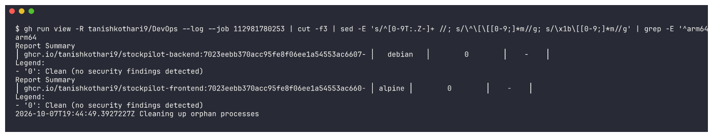

<sub>Full output: [`outputs/54b-ci-log-trivy-arm64.txt`](outputs/54b-ci-log-trivy-arm64.txt)</sub>


```bash
gh run view -R tanishkothari9/DevOps --log --job 112982347972 | cut -f3 | sed -E 's/^[0-9T:.Z-]+ //; s/\^\[\[[0-9;]*m//g; s/\x1b\[[0-9;]*m//g' | grep -E '^reports/|^Security gate passed' | head -20
```

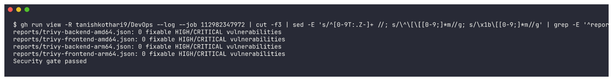

<sub>Full output: [`outputs/55b-ci-log-security-gate-multiarch.txt`](outputs/55b-ci-log-security-gate-multiarch.txt)</sub>


```bash
gh run view -R tanishkothari9/DevOps --log --job 112982403807 | cut -f3 | sed -E 's/^[0-9T:.Z-]+ //; s/\^\[\[[0-9;]*m//g; s/\x1b\[[0-9;]*m//g' | grep -E 'Loaded image|: digest:|== ghcr|^Name:|^MediaType:|Platform:|\{"name"' | grep -v 'set ' | head -30
```

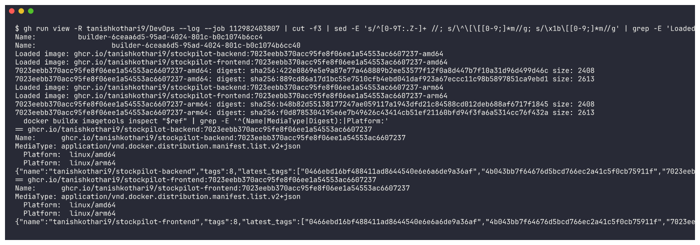

<sub>Full output: [`outputs/56b-ci-log-push-ghcr-multiarch.txt`](outputs/56b-ci-log-push-ghcr-multiarch.txt)</sub>


Pipeline history for this project: run [37665137137](https://github.com/tanishkothari9/DevOps/actions/runs/37665137137) ❌ (frontend test bug, gate blocked push), then [37665562873](https://github.com/tanishkothari9/DevOps/actions/runs/37665562873) ✅, [37669286665](https://github.com/tanishkothari9/DevOps/actions/runs/37669286665) ✅, [37670270022](https://github.com/tanishkothari9/DevOps/actions/runs/37670270022) ✅, [37671753311](https://github.com/tanishkothari9/DevOps/actions/runs/37671753311) ✅ and [37676579566](https://github.com/tanishkothari9/DevOps/actions/runs/37676579566) ✅ (multi-arch) and [37678597656](https://github.com/tanishkothari9/DevOps/actions/runs/37678597656) ✅ (README commit). Full list: [workflow runs](https://github.com/tanishkothari9/DevOps/actions/workflows/final-devops-project.yml).

### Git history

The project was built in small conventional commits (feat / fix / ci), each one pushed and run through the pipeline:

```bash
git log --oneline --format='%h %ad %s' --date=format:'%H:%M' -- . ../../.github/workflows/final-devops-project.yml
```

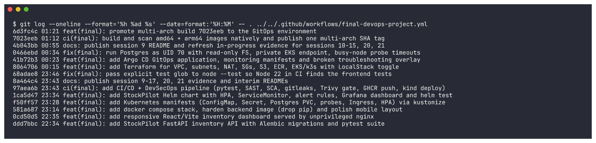

<sub>Full output: [`outputs/87-git-log.txt`](outputs/87-git-log.txt)</sub>


## 11. DevSecOps implementation

| Control | Tool | Local evidence | CI job |
|---|---|---|---|
| SAST | Bandit ([config](security/bandit.yaml)), Semgrep registry rules | 27, 28 | 2 |
| SCA | pip-audit, npm audit, Trivy fs | 29, 30, 31 | 3 |
| Secret scanning | Gitleaks ([config](security/.gitleaks.toml)), working tree + git history | 32 | 4 |
| Container image scanning | Trivy image (both images, amd64 + arm64) | 33, 34, 35 | 5 (54, 54b) |
| IaC misconfiguration | Trivy config (Dockerfiles, k8s, Helm, Terraform) | 47 before/after | 3 (report) |
| Security gate | fails on any finding above. Nothing is pushed or deployed | 52 (blocked), 55, 55b (passed) | 6 |
| Runtime hardening | non-root UIDs, read-only root FS, drop ALL caps, seccomp RuntimeDefault, no pip in image, private EKS endpoint, IMDSv2, encrypted EBS/S3 | 25, 48 | n/a |

All JSON reports are committed under [`security/reports/`](security/reports).

```bash
cd application/backend && bandit -c ../../security/bandit.yaml -r app alembic -f json -o ../../security/reports/bandit.json --exit-zero -q; bandit -c ../../security/bandit.yaml -r app alembic --severity-level medium --confidence-level medium
```

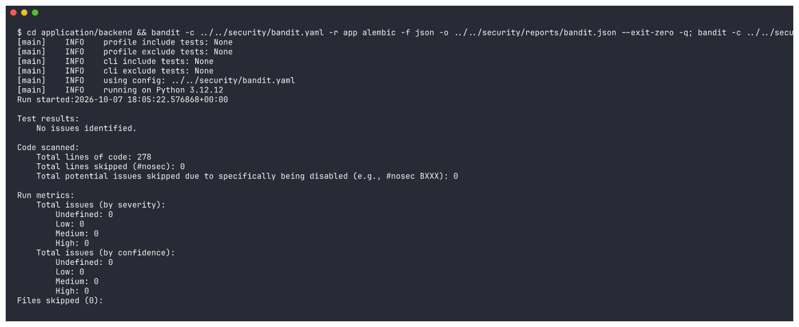

<sub>Full output: [`outputs/27-sast-bandit.txt`](outputs/27-sast-bandit.txt)</sub>


```bash
semgrep scan --metrics=off --error --config p/python --config p/javascript --config p/react --config p/dockerfile --json-output=security/reports/semgrep.json application/backend/app application/backend/alembic application/frontend/src application/backend/Dockerfile application/frontend/Dockerfile 2>&1 | tail -30
```

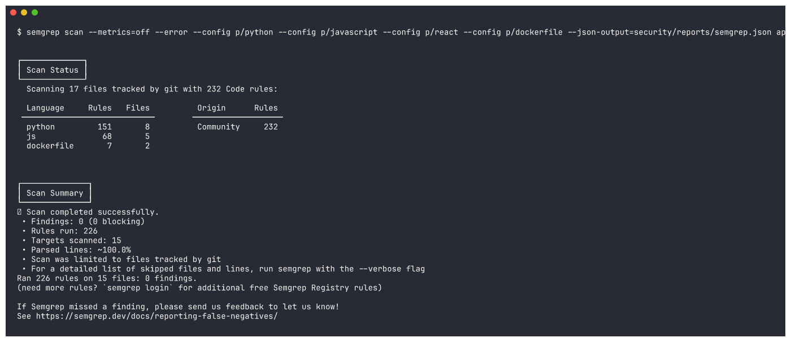

<sub>Full output: [`outputs/28-sast-semgrep.txt`](outputs/28-sast-semgrep.txt)</sub>


```bash
pip-audit -r application/backend/requirements.txt --strict --progress-spinner off -f json -o security/reports/pip-audit.json; pip-audit -r application/backend/requirements.txt --strict --progress-spinner off --desc on
```

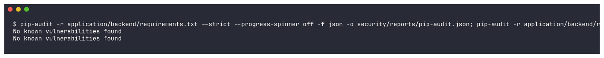

<sub>Full output: [`outputs/29-sca-pip-audit.txt`](outputs/29-sca-pip-audit.txt)</sub>


```bash
cd application/frontend && npm audit --audit-level=high && npm audit --json > ../../security/reports/npm-audit.json; jq '.metadata.vulnerabilities' ../../security/reports/npm-audit.json
```

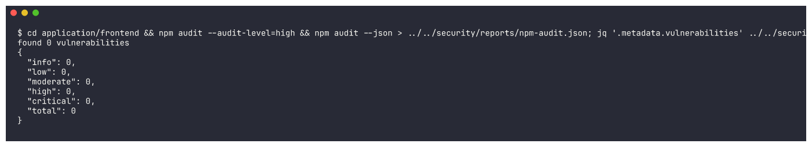

<sub>Full output: [`outputs/30-sca-npm-audit.txt`](outputs/30-sca-npm-audit.txt)</sub>


```bash
trivy fs --quiet --scanners vuln,secret --severity HIGH,CRITICAL --ignore-unfixed --skip-dirs application/frontend/node_modules --exit-code 1 --format json --output security/reports/trivy-fs.json . ; echo "exit code: $?"; trivy fs --quiet --scanners vuln,secret --severity HIGH,CRITICAL --ignore-unfixed --skip-dirs application/frontend/node_modules --exit-code 1 .
```

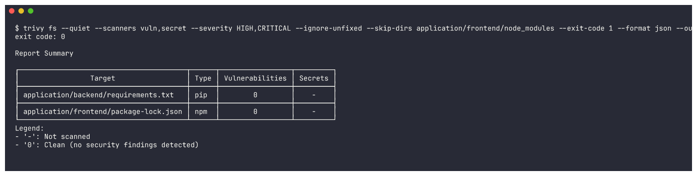

<sub>Full output: [`outputs/31-sca-trivy-fs.txt`](outputs/31-sca-trivy-fs.txt)</sub>


```bash
gitleaks dir . --config security/.gitleaks.toml --redact --no-banner --report-format json --report-path security/reports/gitleaks-dir.json; echo "dir scan exit code: $?"; gitleaks git ../.. --config security/.gitleaks.toml --redact --no-banner --log-opts='-- DevOps-main/final-devops-project' --report-format json --report-path security/reports/gitleaks-history.json; echo "git history scan exit code: $?"
```

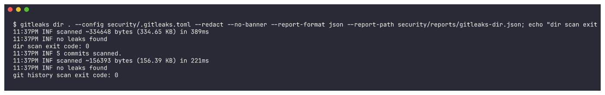

<sub>Full output: [`outputs/32-secrets-gitleaks.txt`](outputs/32-secrets-gitleaks.txt)</sub>


### Trivy before vs after fix

The first backend image failed the gate with **4 HIGH** findings. None of them were in StockPilot's own dependencies. They came from the copies of `urllib3`, `msgpack` and `setuptools` that **pip vendors**: pip ships twice in the image (the base image's `/usr/local` pip and the venv's pip), and the runtime never uses it. The fix was to uninstall pip in both stages of the Dockerfile. After that there were **0 fixable HIGH/CRITICAL** and the gate passed.

```bash
trivy image --quiet --severity HIGH,CRITICAL --ignore-unfixed --exit-code 1 --format json --output security/reports/trivy-backend-before-fix.json stockpilot-backend:before-fix; echo "security gate exit code: $? (1 = FAIL)"; jq -r '.Results[] | select(.Vulnerabilities) | .Vulnerabilities[] | [.PkgName, .InstalledVersion, .FixedVersion, .VulnerabilityID, .Severity] | @tsv' security/reports/trivy-backend-before-fix.json | column -t
```

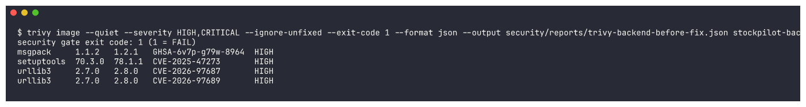

<sub>Full output: [`outputs/33-trivy-image-backend-before-fix.txt`](outputs/33-trivy-image-backend-before-fix.txt)</sub>


```bash
trivy image --quiet --severity HIGH,CRITICAL --ignore-unfixed --exit-code 1 --format json --output security/reports/trivy-backend.json stockpilot-backend:local; echo "security gate exit code: $? (0 = PASS)"; jq -r '[.Results[] | (.Vulnerabilities // []) | length] | add | "HIGH/CRITICAL fixable findings: \(.)"' security/reports/trivy-backend.json; trivy image --quiet --severity HIGH,CRITICAL --format json stockpilot-backend:local | jq -r '[.Results[] | (.Vulnerabilities // [])[] | select(.Status != "fixed")] | "unfixed (no patch available yet) HIGH/CRITICAL in base OS: \(length)"'
```

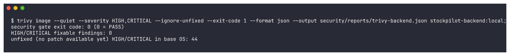

<sub>Full output: [`outputs/34-trivy-image-backend-after-fix.txt`](outputs/34-trivy-image-backend-after-fix.txt)</sub>


```bash
trivy image --quiet --severity HIGH,CRITICAL --ignore-unfixed --exit-code 1 --format json --output security/reports/trivy-frontend.json stockpilot-frontend:local; echo "security gate exit code: $? (0 = PASS)"; trivy image --quiet --severity HIGH,CRITICAL --ignore-unfixed stockpilot-frontend:local
```

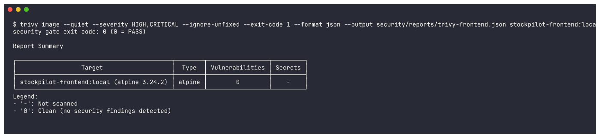

<sub>Full output: [`outputs/35-trivy-image-frontend.txt`](outputs/35-trivy-image-frontend.txt)</sub>


#### Trivy: what was scanned and what the result means

Trivy scanned both images: the OS packages (Debian 13 for the backend, Alpine 3.24 for the frontend) and the language packages (every `*.dist-info` in `/opt/venv`, plus the npm-free nginx image). The gate counts **fixable** HIGH/CRITICAL vulnerabilities (`--ignore-unfixed`). The final images have **0**. The backend's Debian base still has 44 HIGH/CRITICAL CVEs marked *unfixed/will_not_fix* by Debian. Those have no patched package to upgrade to; a rebuild picks up fixes as soon as Debian publishes them. Example from the before-fix scan: **CVE-2026-97689** (urllib3 < 2.8.0), where a malicious server can send an unbounded chunked response that exhausts memory (DoS). It was fixed by removing the vulnerable vendored copy, because the app never uses it.

Trivy output inside the pipeline, and the gate decision:

```bash
gh run view -R tanishkothari9/DevOps --log --job 112944043999 | cut -f3 | sed -E 's/^[0-9T:.Z-]+ //; s/\^\[\[[0-9;]*m//g; s/\x1b\[[0-9;]*m//g' | grep -E 'Report Summary|Target|stockpilot-(backend|frontend):|debian|alpine|Legend|Clean|naming to' | grep -vE 'METADATA|docker run' | head -40
```

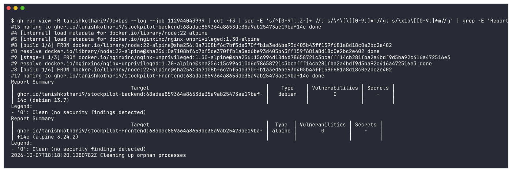

<sub>Full output: [`outputs/54-ci-log-trivy-image-scan.txt`](outputs/54-ci-log-trivy-image-scan.txt)</sub>


```bash
gh run view -R tanishkothari9/DevOps --log --job 112944563898 | cut -f3 | sed -E 's/^[0-9T:.Z-]+ //; s/\^\[\[[0-9;]*m//g; s/\x1b\[[0-9;]*m//g' | grep -E '^reports/|^Security gate passed|Download artifact has finished|Artifact image-scan-reports' | head -20
```

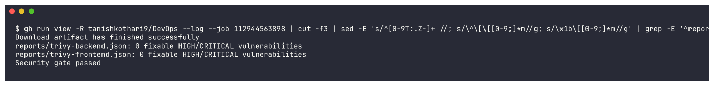

<sub>Full output: [`outputs/55-ci-log-security-gate.txt`](outputs/55-ci-log-security-gate.txt)</sub>


### IaC misconfiguration scan

```bash
trivy config --quiet --severity HIGH,CRITICAL --format json --output security/reports/trivy-config.json . ; trivy config --quiet --severity HIGH,CRITICAL . 2>&1 | grep -E 'Tests:|Failures:|^[A-Z]+ ?\(|AVD-|^\S+ \(' | head -40; jq -r '[.Results[]? | .Misconfigurations // [] | .[] | select(.Status=="FAIL")] | group_by(.ID) | map({id: .[0].ID, severity: .[0].Severity, title: .[0].Title, count: length}) | .[] | "\(.severity)\t\(.id)\t\(.count)x\t\(.title)"' security/reports/trivy-config.json
```

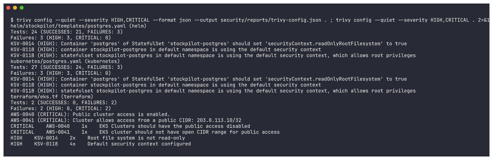

<sub>Full output: [`outputs/47-trivy-config-iac-before.txt`](outputs/47-trivy-config-iac-before.txt)</sub>


The first `trivy config` run (above) reported 2 CRITICAL issues (EKS public endpoint open to a CIDR) and 6 HIGH issues (Postgres running with the default security context, writable root FS, in both the Helm chart and the raw manifests). The EKS endpoint is now private by default (`eks_public_endpoint=false`), and Postgres runs as UID 70 with a read-only root FS. The remaining intentional exceptions are documented inline as `trivy:ignore` comments with a justification: public 80/443 on the ingress SG, node egress for image pulls, and SSE-S3 instead of a CMK for CI artefacts. The re-scan after the fixes is clean:

```bash
trivy config --quiet --severity HIGH,CRITICAL --format json --output security/reports/trivy-config.json . ; jq -r '[.Results[]? | .Misconfigurations // [] | .[] | select(.Status=="FAIL")] | length | "HIGH/CRITICAL misconfigurations: \(.)"' security/reports/trivy-config.json; jq -r '[.Results[]? | select(.Misconfigurations) | .Target] | unique | .[]' security/reports/trivy-config.json | sed 's/^/scanned: /'; trivy config --quiet --severity HIGH,CRITICAL . ; echo "exit code: $?"
```

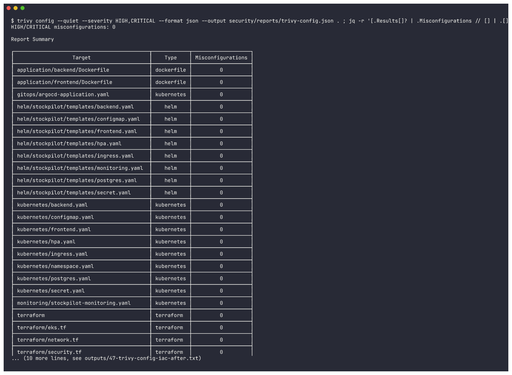

<sub>Full output: [`outputs/47-trivy-config-iac-after.txt`](outputs/47-trivy-config-iac-after.txt)</sub>


## 12. Monitoring

The cluster runs **kube-prometheus-stack** (release `kps`, namespace `monitoring`). The settings this project relies on are in [`monitoring/kps-values.yaml`](monitoring/kps-values.yaml): ServiceMonitors and rules from any namespace, and the Grafana dashboard sidecar watching all namespaces. The Helm chart ships the monitoring objects, and rendered copies are in [`monitoring/`](monitoring):

* **ServiceMonitor** `stockpilot-backend`: scrapes `/metrics` on the backend Service port `http` every 15 s
* **PrometheusRule** `stockpilot-alerts`: `StockPilotBackendDown`, `StockPilotHighErrorRate` (>5% 5xx), `StockPilotHighLatencyP95` (>500 ms), `StockPilotPodRestarting`, `StockPilotHPAAtMaxReplicas`
* **Grafana dashboard** `StockPilot / Application Overview`, a ConfigMap labelled `grafana_dashboard: "1"` with the JSON in [`monitoring/grafana-dashboard-stockpilot.json`](monitoring/grafana-dashboard-stockpilot.json): targets up, req/s, 5xx ratio, p50/p95/p99 latency, HPA replicas, stock movements, CPU and memory per pod

### Metrics endpoint

```bash
kubectl exec -n taskboard deploy/stockpilot-backend -c backend -- python -c "import urllib.request; print(urllib.request.urlopen('http://127.0.0.1:8000/metrics').read().decode())" | grep -E '^(# (HELP|TYPE) (http_requests_total|stockpilot_stock_movements_total|http_request_duration_seconds) |http_requests_total\{|stockpilot_stock_movements_total|http_request_duration_seconds_count)' | head -25
```

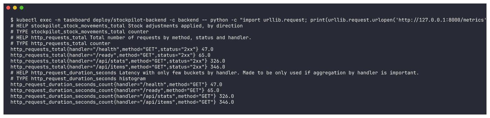

<sub>Full output: [`outputs/60-metrics-endpoint.txt`](outputs/60-metrics-endpoint.txt)</sub>


```bash
kubectl get servicemonitor,prometheusrule,configmap -n taskboard -l app.kubernetes.io/instance=stockpilot && kubectl get servicemonitor stockpilot-backend -n taskboard -o jsonpath='{.spec}' | jq . && kubectl get configmap stockpilot-grafana-dashboard -n taskboard -o jsonpath='{.metadata.labels.grafana_dashboard}' | xargs echo 'grafana_dashboard label ='
```

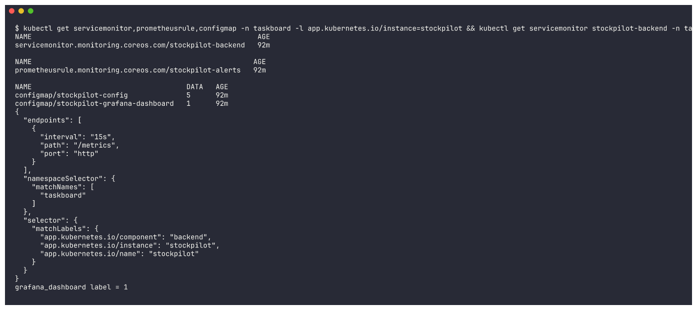

<sub>Full output: [`outputs/61-servicemonitor-prometheusrule.txt`](outputs/61-servicemonitor-prometheusrule.txt)</sub>


### Prometheus: target UP, PromQL, alerts

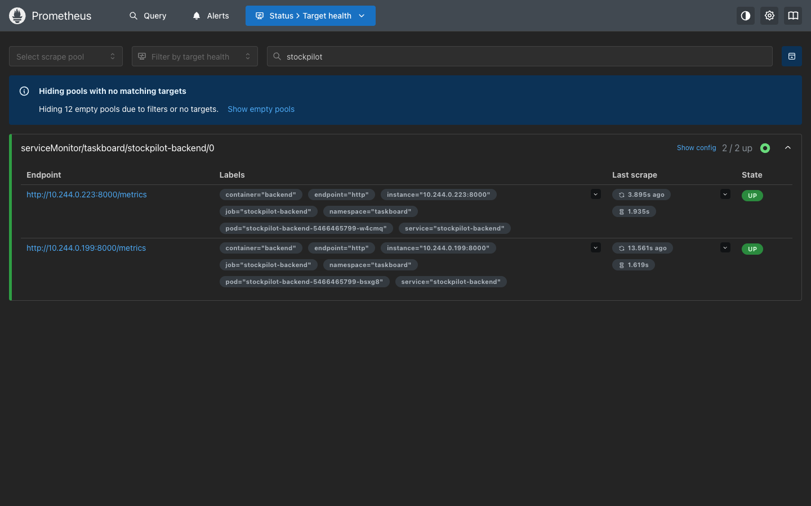

<sub>Prometheus target health: serviceMonitor/taskboard/stockpilot-backend/0, 2/2 UP</sub>


```bash
P=localhost:9091/api/v1/query; q() { echo "PromQL> $1"; curl -s -G $P --data-urlencode "query=$1" | jq -r '.data.result[] | "   \(.metric | del(.__name__) | to_entries | map("\(.key)=\(.value)") | join(","))  =>  \(.value[1])"' | cut -c1-200; }; q 'up{namespace="taskboard",service="stockpilot-backend"}'; q 'sum by (handler) (increase(http_requests_total{namespace="taskboard",handler!="/metrics"}[15m]))'; q 'histogram_quantile(0.95, sum by (le) (rate(http_request_duration_seconds_bucket{namespace="taskboard",handler!="/metrics"}[15m])))'; q 'sum by (direction) (stockpilot_stock_movements_total{namespace="taskboard"})'; q 'sum by (pod) (rate(container_cpu_usage_seconds_total{namespace="taskboard",container="backend"}[5m]))'
```

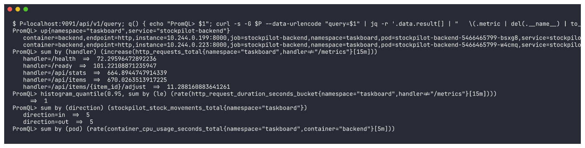

<sub>Full output: [`outputs/63-prometheus-promql.txt`](outputs/63-prometheus-promql.txt)</sub>


The alert rules are loaded. Two of them were **really firing** when this was captured, because of the overloaded shared node: p95 latency above 500 ms, and the backend restarting after failed probes. This is exactly what they were written to catch.

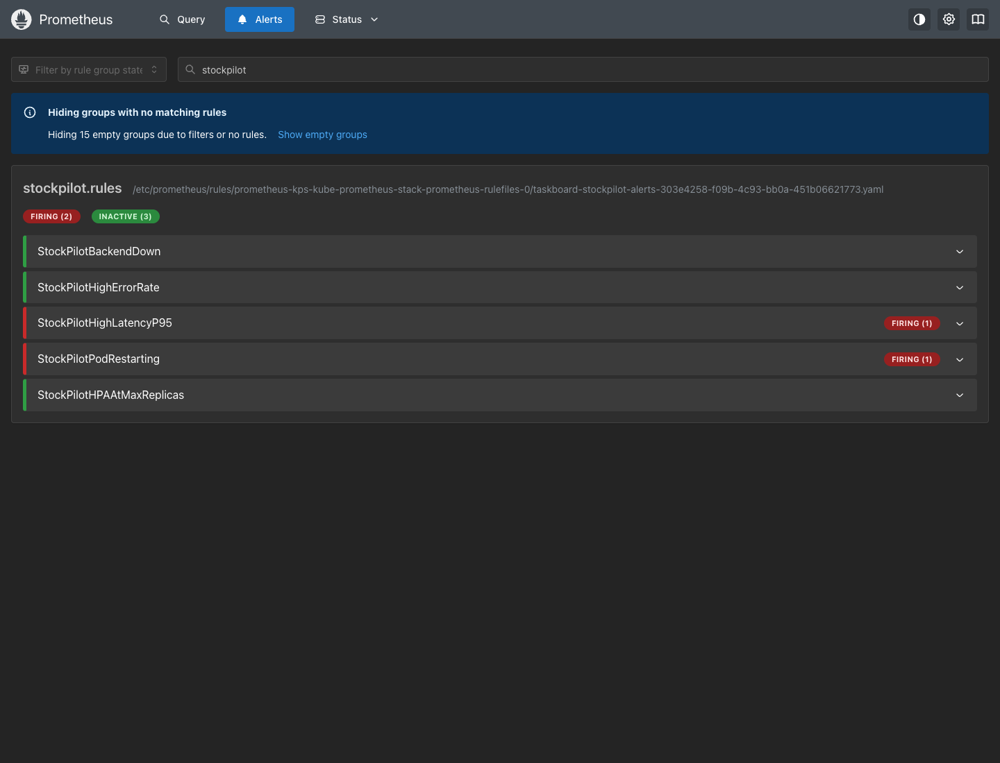

<sub>Prometheus alerts: stockpilot.rules, 2 firing (latency, restarts), 3 inactive</sub>


### Grafana

Grafana (anonymous viewer) loaded the dashboard from the ConfigMap. The gaps in the series are the period when the node was overloaded and scrapes failed. The spikes are the load test and the stock movements generated for the demo.

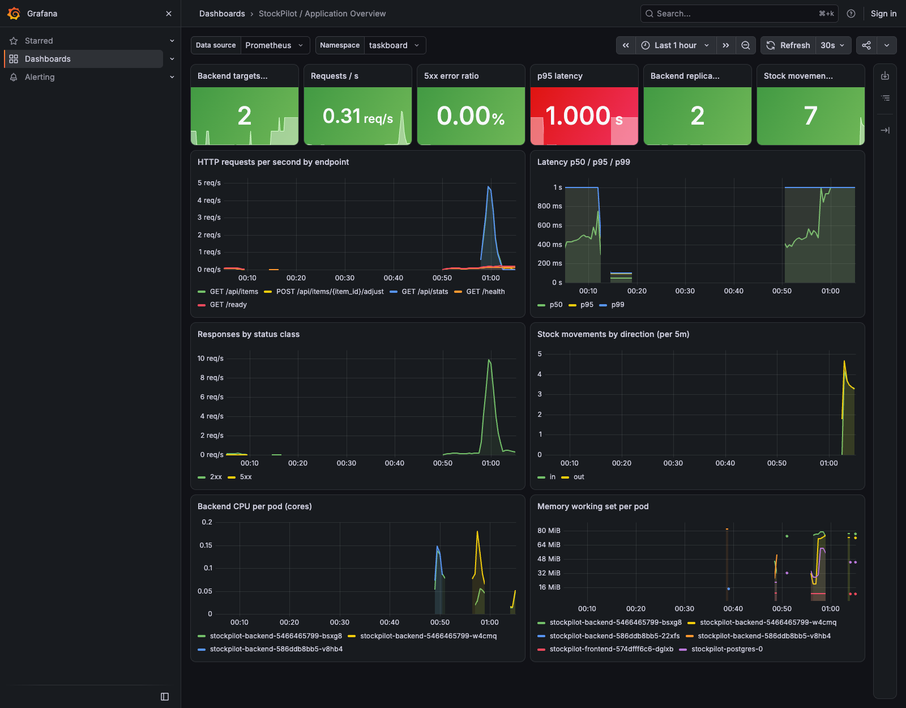

<sub>Grafana: StockPilot / Application Overview (namespace taskboard, last 1 hour)</sub>


### Logs

The backend writes structured JSON log lines for business events, next to uvicorn's access log, and Postgres logs its checkpoints:

```bash
kubectl logs -n taskboard -l app.kubernetes.io/component=backend -c backend --tail=-1 --prefix | grep -E '"logger":"stockpilot"|alembic.runtime|Uvicorn running' | tail -16 | cut -c1-210; echo '--- access log sample'; kubectl logs -n taskboard deploy/stockpilot-backend -c backend --tail=3 | cut -c1-160
```

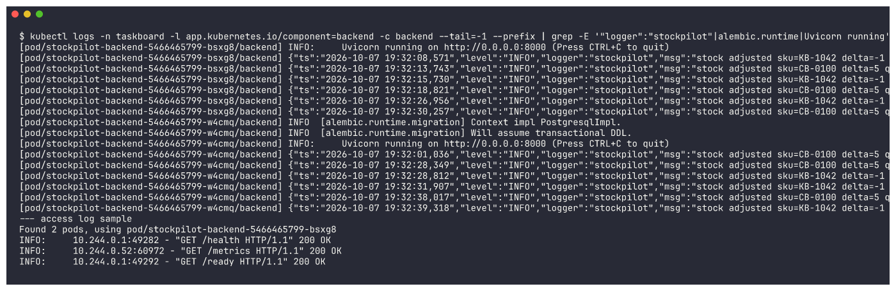

<sub>Full output: [`outputs/66-app-logs.txt`](outputs/66-app-logs.txt)</sub>


## 13. GitOps

[Argo CD](https://argo-cd.readthedocs.io/) runs in the cluster (namespace `argocd`). [`gitops/argocd-application.yaml`](gitops/argocd-application.yaml) declares the Application `stockpilot-gitops`:

* **source:** this repository, branch `main`, path `DevOps-main/final-devops-project/helm/stockpilot` (the same chart), with values from [`gitops/values-gitops.yaml`](gitops/values-gitops.yaml). Those values pin the **GHCR images by commit SHA**.
* **destination:** namespace `taskboard-gitops` (created by Argo CD), ingress host `stockpilot-gitops.local`
* **syncPolicy:** `automated` with `prune` and `selfHeal`, `CreateNamespace`, retry with back-off

The GitOps workflow is: **CI builds, scans and pushes `ghcr.io/...:<sha>` → a commit changes the tag in `gitops/values-gitops.yaml` → Argo CD notices the new Git revision and rolls it out.** Nobody runs `kubectl apply` or `helm upgrade` against this namespace.

```bash
kubectl apply -f gitops/argocd-application.yaml && sleep 20 && kubectl get applications.argoproj.io -n argocd stockpilot-gitops
```

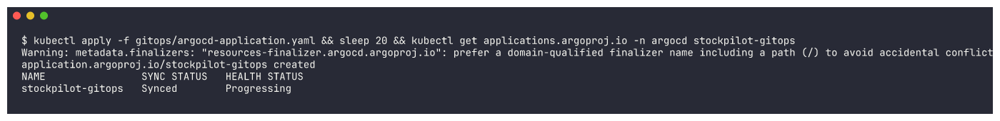

<sub>Full output: [`outputs/67-argocd-app-apply.txt`](outputs/67-argocd-app-apply.txt)</sub>


### First sync: a real failure that GitOps made visible

The first promoted image (`68adae8`) was built on GitHub's **amd64** runners, but this minikube runs on Apple Silicon (**arm64**). Argo CD synced correctly, but the pods crashed with `exec format error`, so the app stayed `Progressing`/`Degraded` instead of `Healthy`:

```bash
kubectl get applications.argoproj.io -n argocd stockpilot-gitops -o jsonpath='{.status.sync.status}/{.status.health.status} revision={.status.sync.revision}{"\n"}'; kubectl get pods -n taskboard-gitops; kubectl logs -n taskboard-gitops deploy/stockpilot-backend -c backend --previous --tail=2; kubectl logs -n taskboard-gitops deploy/stockpilot-frontend --previous --tail=2; echo "node architecture: $(kubectl get node minikube -o jsonpath='{.status.nodeInfo.architecture}')"; docker image inspect --format 'GHCR image {{index .RepoTags 0}} architecture: {{.Architecture}}' ghcr.io/tanishkothari9/stockpilot-backend:68adae859364a8653de35a9ab25473ae19baf14c
```

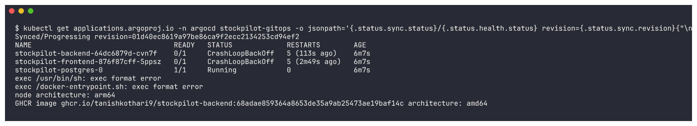

<sub>Full output: [`outputs/68-gitops-first-sync-exec-format-error.txt`](outputs/68-gitops-first-sync-exec-format-error.txt)</sub>


**Fix (in Git, through the pipeline):** commit `7023eeb` changed job 5 into a matrix that builds and Trivy-scans the images natively on `ubuntu-latest` (amd64) **and** `ubuntu-24.04-arm` (arm64). The push job then pushes both scanned images and joins them into one multi-arch SHA tag with `docker buildx imagetools create`:

```bash
for img in stockpilot-backend stockpilot-frontend; do docker buildx imagetools inspect ghcr.io/tanishkothari9/$img:7023eebb370acc95fe8f06ee1a54553ac6607237 | grep -E '^(Name|MediaType):|Platform:'; done
```

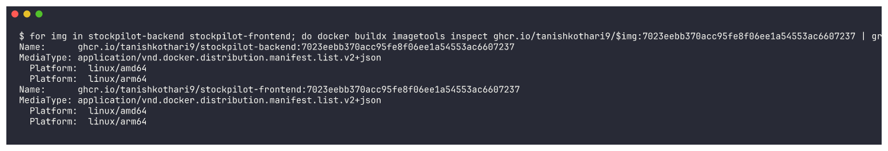

<sub>Full output: [`outputs/69-ghcr-multiarch-tag.txt`](outputs/69-ghcr-multiarch-tag.txt)</sub>


### Promote by commit, and Argo CD rolls it out

```bash
git --no-pager diff -- gitops/values-gitops.yaml && $GITPUSH 'feat(final): promote multi-arch build 7023eeb to the GitOps environment' DevOps-main/final-devops-project/gitops/values-gitops.yaml
```

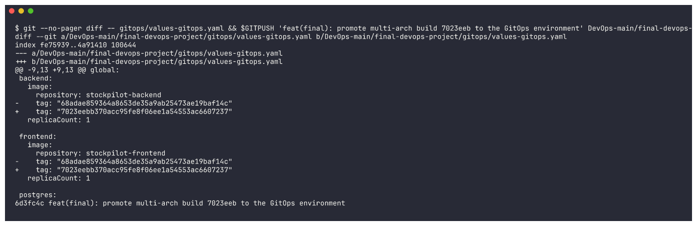

<sub>Full output: [`outputs/70-gitops-commit-image-bump.txt`](outputs/70-gitops-commit-image-bump.txt)</sub>


Argo CD picked up revision `6d3fc4c` (refresh was requested with the `argocd.argoproj.io/refresh` annotation instead of waiting for the 3-minute poll). It synced the new image and the application is **Synced / Healthy**. The sync history shows both revisions:

```bash
kubectl get applications.argoproj.io -n argocd stockpilot-gitops -o wide; kubectl get applications.argoproj.io -n argocd stockpilot-gitops -o jsonpath='{range .status.history[*]}deployed {.deployedAt}  revision {.revision}{"\n"}{end}'; kubectl get applications.argoproj.io -n argocd stockpilot-gitops -o json | jq -r '.status.resources[] | "\(.kind)/\(.name)  \(.status)  \(.health.status // "-")"'; kubectl get pods -n taskboard-gitops -o custom-columns=POD:.metadata.name,STATUS:.status.phase,IMAGE:.spec.containers[0].image; curl -s -H 'Host: stockpilot-gitops.local' localhost:8082/api/info; echo
```

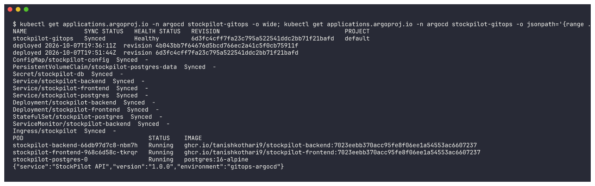

<sub>Full output: [`outputs/71-argocd-synced-healthy.txt`](outputs/71-argocd-synced-healthy.txt)</sub>


### Self-heal: manual drift is reverted

Scaling the Argo CD-managed Deployment to 0 by hand counts as drift from Git. Argo CD put it back to the declared `replicaCount: 1` within 5 seconds:

```bash
kubectl scale deployment stockpilot-backend -n taskboard-gitops --replicas=0 && kubectl get deploy stockpilot-backend -n taskboard-gitops && for i in $(seq 1 12); do sleep 5; r=$(kubectl get deploy stockpilot-backend -n taskboard-gitops -o jsonpath='{.spec.replicas}'); echo "[$(date +%T)] spec.replicas=$r  app=$(kubectl get applications.argoproj.io stockpilot-gitops -n argocd -o jsonpath='{.status.sync.status}/{.status.health.status}')"; [ "$r" = 1 ] && break; done; kubectl rollout status deploy/stockpilot-backend -n taskboard-gitops --timeout=180s; kubectl get applications.argoproj.io stockpilot-gitops -n argocd
```

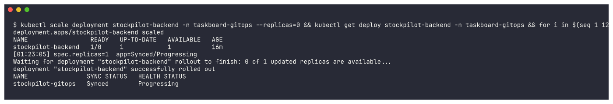

<sub>Full output: [`outputs/71b-argocd-self-heal.txt`](outputs/71b-argocd-self-heal.txt)</sub>


> Argo CD evidence is the `kubectl` output above. The Argo CD UI needs a login, and the shared cluster's Argo CD auth settings were deliberately left unchanged.

## 14. Troubleshooting: final challenge

The healthy base manifests were deployed into a separate namespace, `taskboard-troubleshoot`, with **five faults injected at once** through the kustomize overlay [`troubleshooting/broken/kustomization.yaml`](troubleshooting/broken/kustomization.yaml). That is closer to a real incident than one fault at a time, because faults hide each other: the backend cannot crash on a bad password while it is still waiting for a database that cannot be scheduled. For each fault the loop was **identify → investigate (logs/events/resources) → root cause → fix → verify**.

| # | Injected fault | Symptom | Root cause found with | Fix |
|---|---|---|---|---|
| 1 | Postgres requests `64Gi` memory | `stockpilot-postgres-0` **Pending**, backend stuck in `Init:0/1` | `describe pod` → `FailedScheduling: Insufficient memory` | patch resources back to 128Mi/384Mi, delete the stuck pod |
| 2 | backend reads Secret `stockpilot-db-rotated` (password never applied to Postgres) | backend **CrashLoopBackOff** | `logs --previous` → `password authentication failed for user "stockpilot"` | point `envFrom.secretRef` back to `stockpilot-db` |
| 3 | readiness probe path `/readyz` | backend `Running` but **0/1 Ready**, rollout never finishes | events → `Readiness probe failed: HTTP probe failed with statuscode: 404`. `/ready` answers 200 | patch probe path to `/ready` |
| 4 | frontend image tag `lcoal` | **ErrImagePull / ImagePullBackOff** | events → `pull access denied ... stockpilot-frontend:lcoal`. `minikube image ls` has `:local`, no `:lcoal` | `kubectl set image ...:local` |
| 5 | Service selector `app: stockpilot-backnd` | pods healthy but `/api` returns **503** through the Ingress | `get endpoints` → `<none>`. Selector does not match the pod labels | patch the selector to `stockpilot-backend` |

```bash
kubectl create namespace taskboard-troubleshoot && kubectl apply -k troubleshooting/broken
```

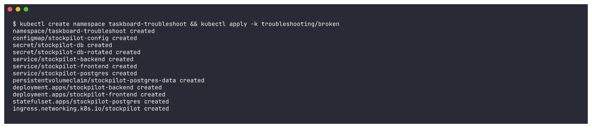

<sub>Full output: [`outputs/72-ts-apply-broken.txt`](outputs/72-ts-apply-broken.txt)</sub>


### Identify: everything is red

```bash
kubectl get pods -n taskboard-troubleshoot -o wide; echo; kubectl get endpoints -n taskboard-troubleshoot; echo; curl -s -o /dev/null -w 'GET /api/info via ingress -> HTTP %{http_code}\n' -H 'Host: stockpilot-troubleshoot.local' localhost:8082/api/info; curl -s -o /dev/null -w 'GET / via ingress -> HTTP %{http_code}\n' -H 'Host: stockpilot-troubleshoot.local' localhost:8082/
```

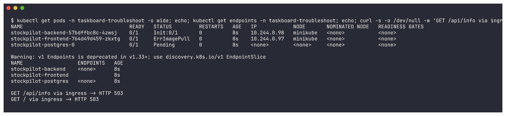

<sub>Full output: [`outputs/73-ts-symptoms.txt`](outputs/73-ts-symptoms.txt)</sub>


### Fault 1: Pending Postgres

```bash
kubectl get pod stockpilot-postgres-0 -n taskboard-troubleshoot; kubectl describe pod stockpilot-postgres-0 -n taskboard-troubleshoot | sed -n '/Limits:/,/Environment:/p;/^Events:/,$p'; echo "node allocatable memory: $(kubectl get node minikube -o jsonpath='{.status.allocatable.memory}')"; kubectl logs -n taskboard-troubleshoot deploy/stockpilot-backend -c wait-for-postgres --tail=3
```

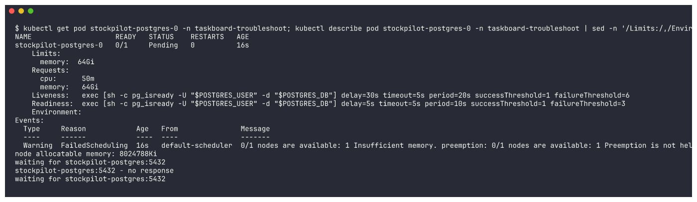

<sub>Full output: [`outputs/74-ts1-pending-investigate.txt`](outputs/74-ts1-pending-investigate.txt)</sub>


**Root cause:** the memory request (64Gi) is larger than the node's allocatable memory, so the scheduler can never place the pod. **Fix + verify:** a StatefulSet does not replace a pod that never became Ready, so after patching the template the stuck pod has to be deleted by hand:

```bash
kubectl patch statefulset stockpilot-postgres -n taskboard-troubleshoot --type=json -p '[{"op":"replace","path":"/spec/template/spec/containers/0/resources","value":{"requests":{"cpu":"50m","memory":"128Mi"},"limits":{"cpu":"500m","memory":"384Mi"}}}]' && kubectl delete pod stockpilot-postgres-0 -n taskboard-troubleshoot && sleep 5 && kubectl wait --for=condition=Ready pod/stockpilot-postgres-0 -n taskboard-troubleshoot --timeout=180s && kubectl get pods -n taskboard-troubleshoot && kubectl get pvc -n taskboard-troubleshoot
```

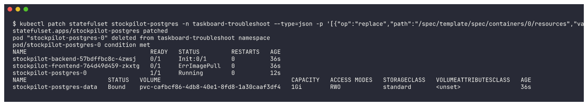

<sub>Full output: [`outputs/75-ts1-fix-verify.txt`](outputs/75-ts1-fix-verify.txt)</sub>


### Fault 2: backend CrashLoopBackOff

```bash
kubectl get pods -n taskboard-troubleshoot -l app=stockpilot-backend; kubectl logs -n taskboard-troubleshoot deploy/stockpilot-backend -c backend --previous --tail=40 | grep -E 'OperationalError|FATAL|password' | head -3 | cut -c1-200; kubectl get deploy stockpilot-backend -n taskboard-troubleshoot -o jsonpath='{.spec.template.spec.containers[0].envFrom}' | jq -c .; kubectl get statefulset stockpilot-postgres -n taskboard-troubleshoot -o jsonpath='{.spec.template.spec.containers[0].env[2]}' | jq -c .
```

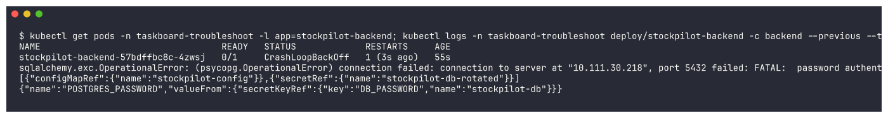

<sub>Full output: [`outputs/76-ts2-crashloop-investigate.txt`](outputs/76-ts2-crashloop-investigate.txt)</sub>


**Root cause:** the Deployment was switched to a "rotated" Secret, but the password was never changed in PostgreSQL, so Alembic fails authentication at start-up and the container exits. **Fix + verify:** the new pod connects, runs migrations and starts uvicorn. Its log already shows the next fault: the kubelet keeps calling `/readyz` and gets 404. The rollout cannot finish yet, so the old crashing pod stays around until fault 3 is fixed.

```bash
kubectl get deploy stockpilot-backend -n taskboard-troubleshoot -o jsonpath='{.spec.template.spec.containers[0].envFrom}' | jq -c .; kubectl get pods -n taskboard-troubleshoot -l app=stockpilot-backend; NEW=$(kubectl get pods -n taskboard-troubleshoot -l app=stockpilot-backend --sort-by=.metadata.creationTimestamp -o name | tail -1); echo "logs of $NEW:"; kubectl logs -n taskboard-troubleshoot $NEW -c backend | grep -E 'Running upgrade|Uvicorn running|startup complete|GET /readyz' | tail -5
```

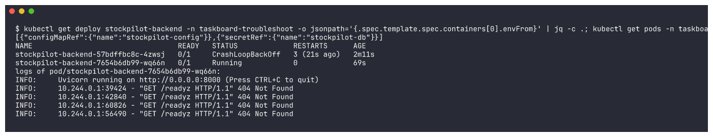

<sub>Full output: [`outputs/77-ts2-fix-verify.txt`](outputs/77-ts2-fix-verify.txt)</sub>


### Fault 3: Running but never Ready

```bash
NEW=$(kubectl get pods -n taskboard-troubleshoot -l app=stockpilot-backend --sort-by=.metadata.creationTimestamp -o name | tail -1); kubectl describe -n taskboard-troubleshoot $NEW | grep -E 'Readiness:|Ready:|Unhealthy' | cut -c1-200 | tail -5; kubectl rollout status deploy/stockpilot-backend -n taskboard-troubleshoot --timeout=10s; kubectl exec -n taskboard-troubleshoot $NEW -c backend -- python -c "import urllib.request as u
```

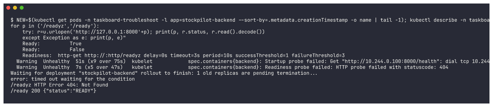

<sub>Full output: [`outputs/78-ts3-readiness-investigate.txt`](outputs/78-ts3-readiness-investigate.txt)</sub>


**Root cause:** the probe checks `/readyz`, which the API does not serve (404), so the kubelet keeps the pod out of the Service endpoints. **Fix + verify:**

```bash
kubectl patch deployment stockpilot-backend -n taskboard-troubleshoot --type=json -p '[{"op":"replace","path":"/spec/template/spec/containers/0/readinessProbe/httpGet/path","value":"/ready"}]' && kubectl rollout status deploy/stockpilot-backend -n taskboard-troubleshoot --timeout=240s && kubectl get pods -n taskboard-troubleshoot -l app=stockpilot-backend && kubectl get endpointslices -n taskboard-troubleshoot -l kubernetes.io/service-name=stockpilot-backend
```

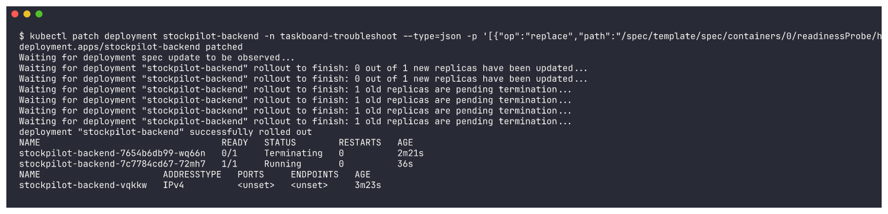

<sub>Full output: [`outputs/79-ts3-fix-verify.txt`](outputs/79-ts3-fix-verify.txt)</sub>


### Fault 4: ImagePullBackOff

```bash
kubectl get pods -n taskboard-troubleshoot -l app=stockpilot-frontend; kubectl get deploy stockpilot-frontend -n taskboard-troubleshoot -o jsonpath='image: {.spec.template.spec.containers[0].image}  pullPolicy: {.spec.template.spec.containers[0].imagePullPolicy}{"\n"}'; kubectl get events -n taskboard-troubleshoot --field-selector reason=Failed -o jsonpath='{.items[0].message}' | fold -w 150; echo; echo 'images present on the node:'; minikube image ls | grep stockpilot-frontend
```

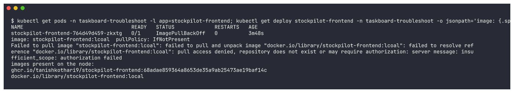

<sub>Full output: [`outputs/80-ts4-imagepull-investigate.txt`](outputs/80-ts4-imagepull-investigate.txt)</sub>


**Root cause:** the tag typo `lcoal` does not exist locally (`imagePullPolicy: IfNotPresent`), so the kubelet tries Docker Hub and is denied. **Fix + verify:**

```bash
kubectl set image deployment/stockpilot-frontend frontend=stockpilot-frontend:local -n taskboard-troubleshoot && kubectl rollout status deploy/stockpilot-frontend -n taskboard-troubleshoot --timeout=180s && kubectl get pods -n taskboard-troubleshoot -l app=stockpilot-frontend
```

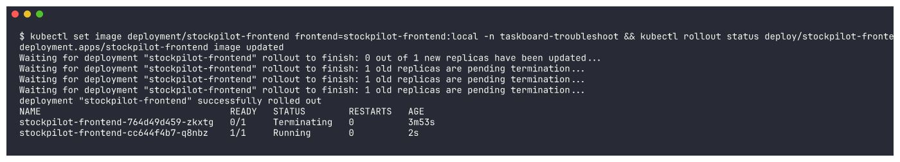

<sub>Full output: [`outputs/81-ts4-fix-verify.txt`](outputs/81-ts4-fix-verify.txt)</sub>


### Fault 5: Service with no endpoints

```bash
kubectl get pods -n taskboard-troubleshoot; curl -s -w '\nGET /api/info via ingress -> HTTP %{http_code}\n' -H 'Host: stockpilot-troubleshoot.local' localhost:8082/api/info | tail -2; kubectl get endpoints stockpilot-backend -n taskboard-troubleshoot 2>/dev/null; kubectl get svc stockpilot-backend -n taskboard-troubleshoot -o jsonpath='service selector: {.spec.selector}{"\n"}'; kubectl get pods -n taskboard-troubleshoot -l app=stockpilot-backend --show-labels | awk '{print $1, $NF}'
```

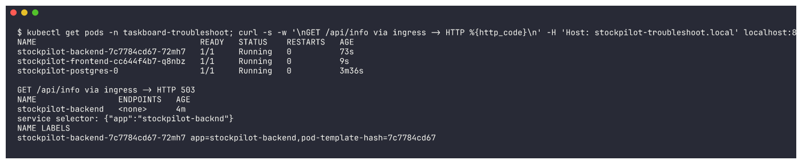

<sub>Full output: [`outputs/82-ts5-service-investigate.txt`](outputs/82-ts5-service-investigate.txt)</sub>


**Root cause:** a Service routes to pods by label. With the typo `stockpilot-backnd` it selects nothing, so the Endpoints object is empty and ingress-nginx answers 503. **Fix + verify:** right after the patch, ingress-nginx still returned 503 for a few seconds while it picked up the new endpoints. The capture below is the re-run, so `kubectl` reports `patched (no change)`, the endpoint is present and the API answers 200:

```bash
kubectl patch service stockpilot-backend -n taskboard-troubleshoot -p '{"spec":{"selector":{"app":"stockpilot-backend"}}}' && kubectl get service stockpilot-backend -n taskboard-troubleshoot -o jsonpath='service selector: {.spec.selector}{"\n"}' && kubectl get endpoints stockpilot-backend -n taskboard-troubleshoot 2>/dev/null && for i in 1 2 3 4 5 6 7 8 9 10; do code=$(curl -s -o /dev/null -w '%{http_code}' -H 'Host: stockpilot-troubleshoot.local' localhost:8082/api/info); echo "attempt $i: GET /api/info via ingress -> HTTP $code"; [ "$code" = 200 ] && break; sleep 3; done; curl -s -H 'Host: stockpilot-troubleshoot.local' localhost:8082/api/info; echo
```

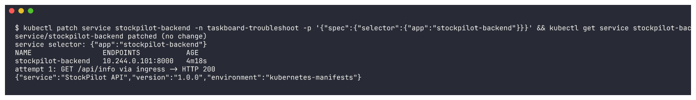

<sub>Full output: [`outputs/83-ts5-fix-verify.txt`](outputs/83-ts5-fix-verify.txt)</sub>


### Verified healthy end to end, then cleaned up

```bash
kubectl get pods,svc,endpoints,pvc,ing -n taskboard-troubleshoot 2>/dev/null; BASE_URL=http://localhost:8082 HOST_HEADER=stockpilot-troubleshoot.local ./scripts/seed.sh && curl -s -H 'Host: stockpilot-troubleshoot.local' localhost:8082/api/stats | jq -c . && curl -s -o /dev/null -w 'GET / (frontend) via ingress -> HTTP %{http_code}\n' -H 'Host: stockpilot-troubleshoot.local' localhost:8082/
```

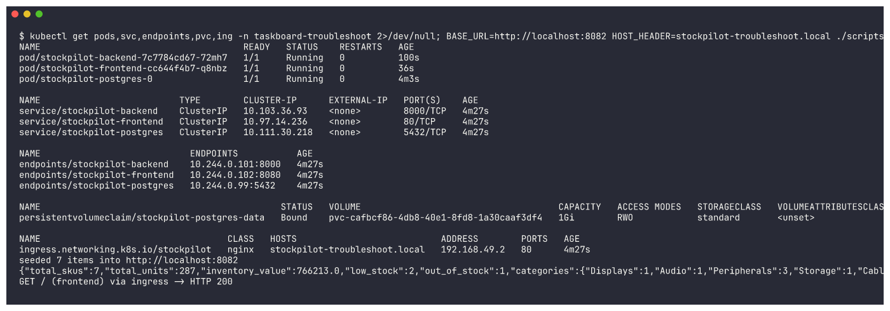

<sub>Full output: [`outputs/84-ts-final-healthy.txt`](outputs/84-ts-final-healthy.txt)</sub>


```bash
kubectl delete namespace taskboard-troubleshoot --wait=true && kubectl get namespace taskboard-troubleshoot
```

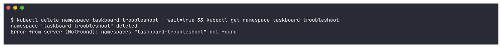

<sub>Full output: [`outputs/85-ts-cleanup.txt`](outputs/85-ts-cleanup.txt)</sub>


**Permanent fix:** the faults only exist in the `broken/` overlay. The base manifests in `kubernetes/` and the Helm chart are correct, and in the GitOps namespace a manual `kubectl` fix would be reverted by Argo CD self-heal anyway (section 13). The durable fix is always a commit.

## 15. Screenshots

Every screenshot embedded above, plus its raw output file:

The cluster's final state (Helm release, HPA, GitOps namespace, Argo CD app):

```bash
kubectl get all,ing,hpa,pvc,cm,secret -n taskboard; echo; helm list -n taskboard; echo; kubectl get all -n taskboard-gitops; kubectl get applications.argoproj.io -n argocd stockpilot-gitops
```

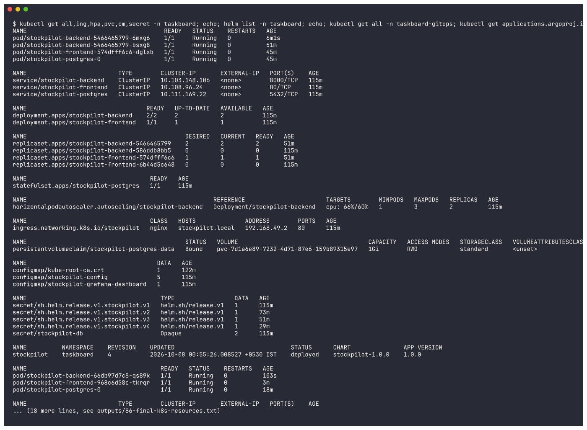

<sub>Full output: [`outputs/86-final-k8s-resources.txt`](outputs/86-final-k8s-resources.txt)</sub>


| Screenshot | Image | Raw output |
|---|---|---|
| `01-pytest-coverage` | [png](screenshots/01-pytest-coverage.png) | [txt](outputs/01-pytest-coverage.txt) |
| `02-frontend-test-build` | [png](screenshots/02-frontend-test-build.png) | [txt](outputs/02-frontend-test-build.txt) |
| `03-docker-build-backend` | [png](screenshots/03-docker-build-backend.png) | [txt](outputs/03-docker-build-backend.txt) |
| `04-docker-build-frontend` | [png](screenshots/04-docker-build-frontend.png) | [txt](outputs/04-docker-build-frontend.txt) |
| `05-docker-compose-up` | [png](screenshots/05-docker-compose-up.png) | [txt](outputs/05-docker-compose-up.txt) |
| `06-docker-compose-ps` | [png](screenshots/06-docker-compose-ps.png) | [txt](outputs/06-docker-compose-ps.txt) |
| `07-compose-seed-and-curl` | [png](screenshots/07-compose-seed-and-curl.png) | [txt](outputs/07-compose-seed-and-curl.txt) |
| `08-compose-crud-api` | [png](screenshots/08-compose-crud-api.png) | [txt](outputs/08-compose-crud-api.txt) |
| `09-ui-desktop-compose` | [png](screenshots/09-ui-desktop-compose.png) | browser screenshot |
| `10-ui-mobile-compose` | [png](screenshots/10-ui-mobile-compose.png) | browser screenshot |
| `11-fastapi-docs` | [png](screenshots/11-fastapi-docs.png) | browser screenshot |
| `12-compose-postgres-tables` | [png](screenshots/12-compose-postgres-tables.png) | [txt](outputs/12-compose-postgres-tables.txt) |
| `12b-compose-down` | [png](screenshots/12b-compose-down.png) | [txt](outputs/12b-compose-down.txt) |
| `13-minikube-image-load` | [png](screenshots/13-minikube-image-load.png) | [txt](outputs/13-minikube-image-load.txt) |
| `14-kubectl-apply-manifests` | [png](screenshots/14-kubectl-apply-manifests.png) | [txt](outputs/14-kubectl-apply-manifests.txt) |
| `15-k8s-manifests-resources` | [png](screenshots/15-k8s-manifests-resources.png) | [txt](outputs/15-k8s-manifests-resources.txt) |
| `16-k8s-manifests-ingress-curl` | [png](screenshots/16-k8s-manifests-ingress-curl.png) | [txt](outputs/16-k8s-manifests-ingress-curl.txt) |
| `17-kubectl-delete-manifests` | [png](screenshots/17-kubectl-delete-manifests.png) | [txt](outputs/17-kubectl-delete-manifests.txt) |
| `18-helm-lint-template` | [png](screenshots/18-helm-lint-template.png) | [txt](outputs/18-helm-lint-template.txt) |
| `19-helm-install` | [png](screenshots/19-helm-install.png) | [txt](outputs/19-helm-install.txt) |
| `20-helm-list-and-test` | [png](screenshots/20-helm-list-and-test.png) | [txt](outputs/20-helm-list-and-test.txt) |
| `21-helm-k8s-resources` | [png](screenshots/21-helm-k8s-resources.png) | [txt](outputs/21-helm-k8s-resources.txt) |
| `22-helm-ingress-curl` | [png](screenshots/22-helm-ingress-curl.png) | [txt](outputs/22-helm-ingress-curl.txt) |
| `23-ui-via-ingress-desktop` | [png](screenshots/23-ui-via-ingress-desktop.png) | browser screenshot |
| `24-ui-via-ingress-mobile` | [png](screenshots/24-ui-via-ingress-mobile.png) | browser screenshot |
| `25-k8s-probes-config` | [png](screenshots/25-k8s-probes-config.png) | [txt](outputs/25-k8s-probes-config.txt) |
| `26-pvc-persistence` | [png](screenshots/26-pvc-persistence.png) | [txt](outputs/26-pvc-persistence.txt) |
| `27-sast-bandit` | [png](screenshots/27-sast-bandit.png) | [txt](outputs/27-sast-bandit.txt) |
| `28-sast-semgrep` | [png](screenshots/28-sast-semgrep.png) | [txt](outputs/28-sast-semgrep.txt) |
| `29-sca-pip-audit` | [png](screenshots/29-sca-pip-audit.png) | [txt](outputs/29-sca-pip-audit.txt) |
| `30-sca-npm-audit` | [png](screenshots/30-sca-npm-audit.png) | [txt](outputs/30-sca-npm-audit.txt) |
| `31-sca-trivy-fs` | [png](screenshots/31-sca-trivy-fs.png) | [txt](outputs/31-sca-trivy-fs.txt) |
| `32-secrets-gitleaks` | [png](screenshots/32-secrets-gitleaks.png) | [txt](outputs/32-secrets-gitleaks.txt) |
| `33-trivy-image-backend-before-fix` | [png](screenshots/33-trivy-image-backend-before-fix.png) | [txt](outputs/33-trivy-image-backend-before-fix.txt) |
| `34-trivy-image-backend-after-fix` | [png](screenshots/34-trivy-image-backend-after-fix.png) | [txt](outputs/34-trivy-image-backend-after-fix.txt) |
| `35-trivy-image-frontend` | [png](screenshots/35-trivy-image-frontend.png) | [txt](outputs/35-trivy-image-frontend.txt) |
| `36-actionlint-workflow` | [png](screenshots/36-actionlint-workflow.png) | [txt](outputs/36-actionlint-workflow.txt) |
| `37-terraform-init` | [png](screenshots/37-terraform-init.png) | [txt](outputs/37-terraform-init.txt) |
| `38-terraform-fmt-validate` | [png](screenshots/38-terraform-fmt-validate.png) | [txt](outputs/38-terraform-fmt-validate.txt) |
| `39-terraform-plan-eks-preview` | [png](screenshots/39-terraform-plan-eks-preview.png) | [txt](outputs/39-terraform-plan-eks-preview.txt) |
| `40-terraform-plan-localstack` | [png](screenshots/40-terraform-plan-localstack.png) | [txt](outputs/40-terraform-plan-localstack.txt) |
| `41-terraform-apply-localstack` | [png](screenshots/41-terraform-apply-localstack.png) | [txt](outputs/41-terraform-apply-localstack.txt) |
| `42-terraform-output` | [png](screenshots/42-terraform-output.png) | [txt](outputs/42-terraform-output.txt) |
| `43-terraform-state-list` | [png](screenshots/43-terraform-state-list.png) | [txt](outputs/43-terraform-state-list.txt) |
| `44-localstack-verify-aws-cli` | [png](screenshots/44-localstack-verify-aws-cli.png) | [txt](outputs/44-localstack-verify-aws-cli.txt) |
| `45-terraform-plan-after-apply` | [png](screenshots/45-terraform-plan-after-apply.png) | [txt](outputs/45-terraform-plan-after-apply.txt) |
| `46-terraform-destroy` | [png](screenshots/46-terraform-destroy.png) | [txt](outputs/46-terraform-destroy.txt) |
| `47-trivy-config-iac-after` | [png](screenshots/47-trivy-config-iac-after.png) | [txt](outputs/47-trivy-config-iac-after.txt) |
| `47-trivy-config-iac-before` | [png](screenshots/47-trivy-config-iac-before.png) | [txt](outputs/47-trivy-config-iac-before.txt) |
| `48-helm-upgrade-postgres-hardening` | [png](screenshots/48-helm-upgrade-postgres-hardening.png) | [txt](outputs/48-helm-upgrade-postgres-hardening.txt) |
| `49-ghcr-images` | [png](screenshots/49-ghcr-images.png) | [txt](outputs/49-ghcr-images.txt) |
| `50-ghcr-package-page-backend` | [png](screenshots/50-ghcr-package-page-backend.png) | browser screenshot |
| `51-gha-run-green-graph` | [png](screenshots/51-gha-run-green-graph.png) | browser screenshot |
| `52-gha-run1-failed-gate-blocked` | [png](screenshots/52-gha-run1-failed-gate-blocked.png) | browser screenshot |
| `53-ci-log-pytest` | [png](screenshots/53-ci-log-pytest.png) | [txt](outputs/53-ci-log-pytest.txt) |
| `54-ci-log-trivy-image-scan` | [png](screenshots/54-ci-log-trivy-image-scan.png) | [txt](outputs/54-ci-log-trivy-image-scan.txt) |
| `54b-ci-log-trivy-arm64` | [png](screenshots/54b-ci-log-trivy-arm64.png) | [txt](outputs/54b-ci-log-trivy-arm64.txt) |
| `55-ci-log-security-gate` | [png](screenshots/55-ci-log-security-gate.png) | [txt](outputs/55-ci-log-security-gate.txt) |
| `55b-ci-log-security-gate-multiarch` | [png](screenshots/55b-ci-log-security-gate-multiarch.png) | [txt](outputs/55b-ci-log-security-gate-multiarch.txt) |
| `56-ci-log-push-ghcr` | [png](screenshots/56-ci-log-push-ghcr.png) | [txt](outputs/56-ci-log-push-ghcr.txt) |
| `56b-ci-log-push-ghcr-multiarch` | [png](screenshots/56b-ci-log-push-ghcr-multiarch.png) | [txt](outputs/56b-ci-log-push-ghcr-multiarch.txt) |
| `57-ci-log-deploy-kind` | [png](screenshots/57-ci-log-deploy-kind.png) | [txt](outputs/57-ci-log-deploy-kind.txt) |
| `58-hpa-load-test` | [png](screenshots/58-hpa-load-test.png) | [txt](outputs/58-hpa-load-test.txt) |
| `58a-hpa-load-test-during-overload` | [png](screenshots/58a-hpa-load-test-during-overload.png) | [txt](outputs/58a-hpa-load-test-during-overload.txt) |
| `59-hpa-metrics-investigation` | [png](screenshots/59-hpa-metrics-investigation.png) | [txt](outputs/59-hpa-metrics-investigation.txt) |
| `59b-hpa-scale-events` | [png](screenshots/59b-hpa-scale-events.png) | [txt](outputs/59b-hpa-scale-events.txt) |
| `60-metrics-endpoint` | [png](screenshots/60-metrics-endpoint.png) | [txt](outputs/60-metrics-endpoint.txt) |
| `61-servicemonitor-prometheusrule` | [png](screenshots/61-servicemonitor-prometheusrule.png) | [txt](outputs/61-servicemonitor-prometheusrule.txt) |
| `62-prometheus-targets-up` | [png](screenshots/62-prometheus-targets-up.png) | browser screenshot |
| `63-prometheus-promql` | [png](screenshots/63-prometheus-promql.png) | [txt](outputs/63-prometheus-promql.txt) |
| `64-prometheus-alert-rules` | [png](screenshots/64-prometheus-alert-rules.png) | browser screenshot |
| `65-grafana-dashboard` | [png](screenshots/65-grafana-dashboard.png) | browser screenshot |
| `66-app-logs` | [png](screenshots/66-app-logs.png) | [txt](outputs/66-app-logs.txt) |
| `67-argocd-app-apply` | [png](screenshots/67-argocd-app-apply.png) | [txt](outputs/67-argocd-app-apply.txt) |
| `68-gitops-first-sync-exec-format-error` | [png](screenshots/68-gitops-first-sync-exec-format-error.png) | [txt](outputs/68-gitops-first-sync-exec-format-error.txt) |
| `69-ghcr-multiarch-tag` | [png](screenshots/69-ghcr-multiarch-tag.png) | [txt](outputs/69-ghcr-multiarch-tag.txt) |
| `70-gitops-commit-image-bump` | [png](screenshots/70-gitops-commit-image-bump.png) | [txt](outputs/70-gitops-commit-image-bump.txt) |
| `71-argocd-synced-healthy` | [png](screenshots/71-argocd-synced-healthy.png) | [txt](outputs/71-argocd-synced-healthy.txt) |
| `71b-argocd-self-heal` | [png](screenshots/71b-argocd-self-heal.png) | [txt](outputs/71b-argocd-self-heal.txt) |
| `72-ts-apply-broken` | [png](screenshots/72-ts-apply-broken.png) | [txt](outputs/72-ts-apply-broken.txt) |
| `73-ts-symptoms` | [png](screenshots/73-ts-symptoms.png) | [txt](outputs/73-ts-symptoms.txt) |
| `74-ts1-pending-investigate` | [png](screenshots/74-ts1-pending-investigate.png) | [txt](outputs/74-ts1-pending-investigate.txt) |
| `75-ts1-fix-verify` | [png](screenshots/75-ts1-fix-verify.png) | [txt](outputs/75-ts1-fix-verify.txt) |
| `76-ts2-crashloop-investigate` | [png](screenshots/76-ts2-crashloop-investigate.png) | [txt](outputs/76-ts2-crashloop-investigate.txt) |
| `77-ts2-fix-verify` | [png](screenshots/77-ts2-fix-verify.png) | [txt](outputs/77-ts2-fix-verify.txt) |
| `78-ts3-readiness-investigate` | [png](screenshots/78-ts3-readiness-investigate.png) | [txt](outputs/78-ts3-readiness-investigate.txt) |
| `79-ts3-fix-verify` | [png](screenshots/79-ts3-fix-verify.png) | [txt](outputs/79-ts3-fix-verify.txt) |
| `80-ts4-imagepull-investigate` | [png](screenshots/80-ts4-imagepull-investigate.png) | [txt](outputs/80-ts4-imagepull-investigate.txt) |
| `81-ts4-fix-verify` | [png](screenshots/81-ts4-fix-verify.png) | [txt](outputs/81-ts4-fix-verify.txt) |
| `82-ts5-service-investigate` | [png](screenshots/82-ts5-service-investigate.png) | [txt](outputs/82-ts5-service-investigate.txt) |
| `83-ts5-fix-verify` | [png](screenshots/83-ts5-fix-verify.png) | [txt](outputs/83-ts5-fix-verify.txt) |
| `84-ts-final-healthy` | [png](screenshots/84-ts-final-healthy.png) | [txt](outputs/84-ts-final-healthy.txt) |
| `85-ts-cleanup` | [png](screenshots/85-ts-cleanup.png) | [txt](outputs/85-ts-cleanup.txt) |
| `86-final-k8s-resources` | [png](screenshots/86-final-k8s-resources.png) | [txt](outputs/86-final-k8s-resources.txt) |
| `87-git-log` | [png](screenshots/87-git-log.png) | [txt](outputs/87-git-log.txt) |
| `88-gha-final-run-multiarch` | [png](screenshots/88-gha-final-run-multiarch.png) | browser screenshot |

## 16. Lessons learned

1. **Scanners find what you ship, not what you wrote.** The 4 HIGH CVEs in the first backend image were in pip's *vendored* `urllib3`/`msgpack`/`setuptools`, not in any app dependency. pip-audit (which only looks at `requirements.txt`) was clean. The fix was to ship less: uninstall pip from the runtime image. Image scanning and dependency scanning answer different questions, so both are needed.
2. **A gate must run even when the things it guards fail.** With plain `needs:`, a failed scan job just *skips* the gate and everything after it. That is safe, but the run doesn't say why. `if: always()` plus an explicit check of `needs.*.result` makes the gate itself turn red and write a summary. Run 1 (a broken frontend test) shows push and deploy being blocked.
3. **Scan once, push what you scanned.** The images are built and scanned once, saved as an artefact, and the push job `docker load`s exactly those bytes. Rebuilding in the push job could produce an image nobody scanned.
4. **libpq needs a username even to ping.** The first `wait-for-postgres` init container hung forever. `pg_isready` running as UID 10001 (no `/etc/passwd` entry) printed `no attempt`, because libpq could not work out a default user. Adding `-U probe` fixed it, since `pg_isready` never authenticates. Reading the init container logs showed this in seconds.
5. **Readiness and liveness are different questions.** `/ready` checks the database and `/health` does not. When the Postgres pod was deleted, API calls failed for a few seconds, but liveness kept passing, so no backend pod was restarted (0 restarts in screenshot 26). Once the DB was back, `/ready` passed again. A liveness probe that checked the DB would have caused pointless restart storms.
6. **Probe timeouts must survive a busy node.** The shared minikube node reached a load average above 150 (peaks over 220) with swap full (about 95 pods from other sessions). 1-second probe timeouts then killed healthy containers in a loop. Timeouts were raised to 3–5 s and the startup window to 2 minutes. The startup probe protects slow boots without weakening liveness afterwards.
7. **`kubectl delete` of a PVC does not always mean the data is gone.** minikube's hostPath provisioner keeps `/tmp/hostpath-provisioner/<ns>/<pvc>`, so the Helm release found the data seeded by the raw manifests. The seed script was made idempotent (treat 409 as "already exists").
8. **An emulator is not the cloud.** LocalStack let the whole Terraform lifecycle run without an AWS account. But community edition has no EKS/ECR, its S3 lifecycle API never satisfies the provider's consistency waiter, and it drops `metadata_options` and adds account prefixes to SG references, so the plan right after apply shows drift. All of this is documented, and the config is written for real AWS first (`use_localstack` defaults to false).
9. **Secure defaults beat warnings.** `trivy config` caught a public EKS endpoint and a root-capable Postgres. Both are now off by default (`eks_public_endpoint=false`, Postgres UID 70 with a read-only root FS). The few intentional exceptions carry an inline `trivy:ignore` with a reason.
10. **Pin and verify the supply chain.** The workflow avoids the compromised `trivy-action`/`setup-trivy` and runs `aquasec/trivy:0.75.0` directly. It uses only `GITHUB_TOKEN` with least-privilege `permissions:` per job, and keeps the image tag = commit SHA, so every running pod traces back to a commit.
11. **Test runners differ between Node versions.** `node --test src/` worked on Node 26 locally but not on Node 22 in CI. An explicit glob (`src/*.test.js`) works on both. Running CI on the same major version as the production image catches this early.
12. **GitOps changes how you fix things.** In the Argo CD-managed namespace, a `kubectl` hot-fix is reverted by self-heal. The only durable change is a commit. That is the point, but it also means an incident runbook has to say "change Git", not "patch the cluster".
13. **Build for the architecture you deploy to.** Images built on amd64 runners crashed on the arm64 minikube with `exec format error`, and only the GitOps rollout exposed it (the CI kind cluster is amd64). Native per-arch builds on `ubuntu-latest` + `ubuntu-24.04-arm`, joined into one manifest list, fixed it without QEMU and still push exactly the scanned images.
14. **Autoscaling depends on the metrics pipeline.** While metrics-server was crash-looping, the HPA reported `FailedGetResourceMetric` and did nothing under load. Once it recovered, the same test scaled 1 → 3 in about 90 s. Alerting on `ScalingActive=False` is worth adding in production.
